# DNR TM Applications of the LM1894

National Semiconductor Application Note 390 Martin Giles Kerry Lacanette March 1985

## INTRODUCTION

The operating principles of a single-ended or non-complementary audio noise reduction system, DNR, have been covered extensively in a previous application note AN384, Audio Noise Reduction and Masking. Although the system was originally implemented with transconductance amplifiers (LM13600) and audio op-amps (LM387), dedicated I/Cs have since been developed to perform the DNR function. The LM1894 is designed to accommodate and noise reduce the line level signals encountered in video recorders, audio tape recorders, radio and television broadcast receivers, and automobile radio/cassette receivers. A companion device, the LM832, is designed to handle the lower signal levels available in low voltage portable audio equipment. This note deals chiefly with the practical aspects of using the LM1894, but the information given can also be applied to the LM832.

## THE BASIC DNR APPLICATION CIRCUIT

At the time of writing, the LM1894 has already found use in a large variety of applications. These include:

- AUTOMOTIVE RADIOS
- TELEVISION RECEIVERS
- HOME MUSIC CENTERS
- PORTABLE STEREOS (BOOM BOXES)
- SATELLITE RECEIVERS
- AUDIO CASSETTE PLAYERS
- AVIONIC ENTERTAINMENT SYSTEMS
- HI-FI AUDIO ACCESSORIES
- BACKGROUND MUSIC SYSTEMS
- ETC.

In the majority of these applications the circuit used is identical to that shown in Figure 1, and this is the basic stereo Dynamic Noise Reduction System. Although a split power supply can be used, a single positive supply voltage is shown, with ac coupled inputs and outputs common in many consumer applications. This supply voltage can be between 4.5 V DC and 18 V DC but operation at the higher end of the range (above 8 V DC ) is preferred, since this will ensure adequate signal handling capability. The LM1894 is optimized for a nominal input signal level of 300 mVrms but with an 8 V DC supply it can handle over 2.5 Vrms at full audio bandwidth. Smaller nominal signal levels can be processed but below 100 mVrms there may not be sufficient gain in the control path to activate the detector with the source noise. In this instance, and where battery powered operation is desired, the LM832 is a better choice. The LM832 has identical operating principles and a similar (but not identical) pinout. It is optimized for input levels around 30 mVrms and a supply voltage range from 1.5 V DC to 9.0 V DC .

The capacitors connected at Pins 12 and 3 determine the range of b 3 dB cut off frequencies for the audio path filters. Increasing the capacitor value scales the range downward the minimum frequency becomes lower and the maximum or full bandwidth frequency will decrease proportionally. Similarly, smaller capacitors will raise the range.

$$f_{-3\text{ dB}} = \frac{I_T}{9.1C} \quad (I_T = 33\text{ }\mu\text{A MIN}) ( = 1.05\text{ }\text{mA MAX})$$

For normal audio applications the recommended value of 0.0033 m F should be adhered to, producing a frequency range from 1 kHz to 35 kHz.

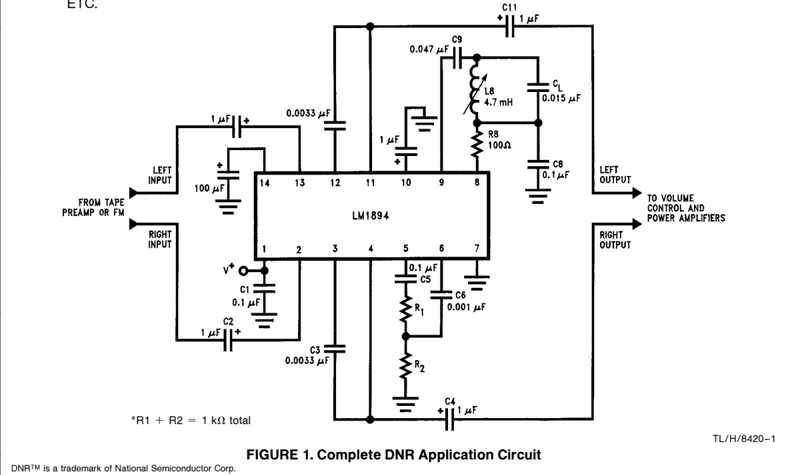

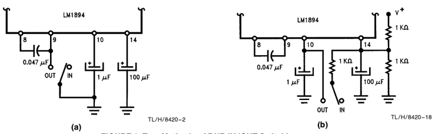

FIGURE 2. Two Methods of DNR IN/OUT Switching

The two resistors connected at Pin 5 set the overall control path gain, and hence the system sensitivity. A lower tap point will decrease the sensitivity for high signal level sources, and a higher tap point will accommodate lower level sources. For purposes of initial calibration it is best to replace the resistors with a 1 k X potentiometer (the wiper arm connecting through C 6 to Pin 6), and follow the procedures outlined below. Once the correct adjustment point has been found, the position of the wiper arm is measured and an equivalent pair of resistors are used to replace the potentiometer. This, of course, can be done only if the source has a relatively fixed noise floor-the output from an audio cassette tape for example. For an add-on audio accessory the potentiometer should be retained as a front panel control to allow adjustment for individual sources. Use of DNR with multiple sources is described later.

## SYSTEM CALIBRATION

System calibration can be performed in a number of ways. With the source connected play a blank but biased section of the cassette tape. Set the potentiometer so that the wiper arm is at ground and then steadily rotate it until a slight increase in the output noise level is heard. Alternatively, with source program material present, set the potentiometer with the wiper arm connected to the Pin 5 end of the slider and again rotate until the high frequency content of the program material appears to begin to be attenuated. Then return the potentiometer wiper slightly towards Pin 5 so that the music is unaffected.

A third method of adjustment can be done with an oscilloscope monitoring the voltage on the control path detector filter capacitor, Pin 10. This will show a steady dc voltage around 1V while the wiper arm of the potentiometer is at ground. As the wiper arm is rotated, this voltage will start to increase. About 200 mV above the quiescent value will usually be the right point. Note that this will not be a steady dc voltage but a random peak, low amplitude sawtooth waveform caused by peak detection of the source noise in the control path.

Whatever method is used to determine the potentiometer setting, this setting should be confirmed by listening to a variety of programs and comparing the audio quality while switching DNR in and out of the circuit. This is easily accomplished by grounding Pin 9 which will disable the control path and force the audio filters to maximum bandwidth,Figure 2(a) . Also shown is a second method of ON/OFF switching that gives an increased maximum bandwidth over that obtained in normal operation. Although the switch is not a required front panel control it can be an important feature. Unlike compander systems, DNR can be switched out leaving the source completely unprocessed in any way. With a switch, the user can always be assured that the noise reduction is not affecting the program material.

Apart from the basic circuit shown in Figure 1, all applications of the DNR system have another feature in commonthe location of the LM1894 in the signal chain. As Figure 3 shows, the LM1894 is always placed right after the signal source pre-amplifier and before any circuit that includes user adjustable controls for volume or frequency response. The reasons for this are obvious. If the gain of the signal amplifier preceding DNR is changed arbitrarily, the noise input level to the LM1894 will not be at the correct point to begin activation of the audio path filters. Either reduced noise reduction will be obtained, or the high frequency content of the program material will be affected. A change in system gain prior to the LM1894 requires a corresponding change in the control path threshold sensitivity. Similarly modifying the frequency response, by heavy boost or cut of the mid to high frequencies, will have the same effect of changing the required threshold setting-apart from modifying the masking qualities of the program material.

## HOW MUCH NOISE REDUCTION?

The actual sensitivity setting that is finally used, and the amount of noise reduction that is obtained, will depend on a number of factors. As the data sheet for the LM1894 and other application notes have explained in some detail, the noise reduction effect is obtained by audio bandwidth restriction with a pair of matched low-pass filters. A CCIR/ARM * weighted noise measurement is used so that the measured improvement obtained with DNR correlates well to the subjective impression of reduced noise. This is another way of stating that the source noise spectrum level versus frequency characteristic can have a large impact on how ''noisy'' we judge a source to be-and concomitantly how much of the ''noisiness'' can be reduced by decreasing the audio bandwidth. Fortunately most of the audio noise sources we deal with are smooth although not necessarily flat, resembling white noise. The weighting characteristic referred to above generally gives excellent correlation. For example, if the source b 3 dB upper frequency limit is only 2 kHz (an AM radio), reducing the audio path bandwidth down to 800 Hz will improve the S/N ratio by only 5 to 7 dB. On the other hand, if the source bandwidth exceeds at least 8 kHz then from 10 dB to 14 dB noise reduction can be obtained. Of course, it is always worth remembering that this is the reduction in the source noise-any noise added in circuitsafter the LM1894 may contribute to the audible output and prevent the full noise reduction effect. To see how easily this can happen, we will consider the noise levels at various points in a typical automotive radio using an I/C tone and volume control, and an I/C power amplifier, both with and without noise reduction of the cassette player.

* See pp. 2-9 to 2-10, Audio Handbook, National Semiconductor 1980.

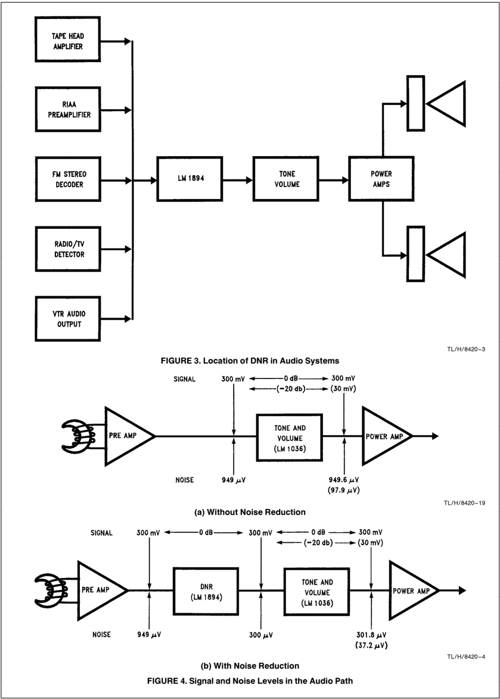

If we assume that the tape head pre-amplifier gain is such that the nominal output level (corresponding to O''VU'') is 300 mVrms, then for a typical cassette tape the noise will be 50 dB lower, or 949 uV. The gain of the tone and volume control (an LM1036) is unity or 0 dB at maximum volume setting, with an output noise level of 33 uV with no signal applied. With the tape pre-amplifier connected, the output noise from the LM1036 will be V n where

$$V_n = 10^{-6} \sqrt{(33)^2 + (949)^2} = 949.6 \mu\text{V}$$

Clearly, the LM1036 has caused an insignificant increase in the background noise level (0.006 dB). Even when the volume control is set at b 20 dB overall gain, the LM1036 intrinsic noise level is 22 m V. The tape noise level is now 94.9 m V ( b 20 dB) and the output noise V n is

$$V_n = 10^{-6} \sqrt{(22)^2 + (94.9)^2} = 97.4 \text{ } \mu\text{V}$$

Once more an insignificant contribution on the part of the LM1036 (0.23 dB).

Now we add noise reduction between the tape head amplifier and the LM1036. Usually this will mean over 10 dB reduction in the tape noise so that the input of the LM1036 sees 300 uV noise. At 0 dB gain we have

$$V_n = 10^{-6} \sqrt{(33)^2 + (300)^2} = 301.8 \mu\text{V}$$

But at -20 dB

$$V_n = 10^{-6} \sqrt{(22)^2 + (30)^2} = 37.2 \text{ }\mu\text{V}$$

When we compare the results of Equation (3) and (5) we see that at -20 dB gain setting we are getting only 8.4 dB noise reduction compared to 10 dB at maximum gain! Since the volume control is not normally set to maximum, this is a significant loss.

Active tone and volume controls are not the only circuits that can contribute to a loss in noise reduction. Most modern automotive radios use I/C power amplifiers delivering in excess of 6 watts into 4 Ohm loads-and even more if bridge amplifiers are employed. With a 12 V DC supply, the output signal swing is limited to less than 4 Vrms if clipping is avoided. Typical amplifiers have an input referred noise level of 2 m Vrms, and with a gain of 40 dB (a typical value) the intrinsic output noise level is 200 uVrms, or 86 dB below clipping. For a normal listening level, the signal amplitude will be 20 dB below clipping which yields a S/N ratio of only 66 dB-which is just better than the noise reduced input to the amplifier.

Many manufacturers recommend using I/C power amplifiers with gains of 60 dB. This will always result in unacceptable noise performance at moderate listening levels since the amplifier generated noise is now over 2 mV. For a signal 20 dB below clipping the output S/N ratio is only 46 dB! It is interesting to note that the inclusion of just 10 dB noise reduction is sufficient to put pressure on the performance standards of the remaining circuits in the audio path of an automotive radio. If more noise reduction is available, such as a combination of Dolby B and DNR, or Dolby C, then the subsequent gain distribution must be considered even more carefully. The power amplifier gain may have to be reduced to 20 dB to avoid degrading the noise performance. In fact it may be impractical to realize the full noise performance capability of systems providing high levels of noise reduction in many automotive stereo radios.

## MODIFICATIONS TO THE STANDARD APPLICATIONS CIRCUIT

### 1. TAPE DECKS WITH EQUALIZATION SWITCHES:

Many modern cassette tape decks and automotive radio cassette players offer at least two types of equalization in the head-preamplifier in order to optimize the frequency response of various tape formulations. These are often identified on the equalization switch as "Normal" and "CrO2" corresponding to 120 us and 70 us time constants in the equalization network. This difference in time constants can mean that the noise floor from a cassette tape in the "CrO2" mode can be up to 4 dB lower than for a tape requiring the "Normal" mode, Figure 5.

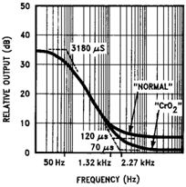

TL/H/8420-5

FIGURE 5. Tape Playback Equalization Including Integration

Although a compromise setting can be found for the DNR threshold setting to accommodate both types of tape, a single pole, double throw switch ganged to the equalization switch will optimize performance for each mode. In the example given inFigure 6, the resistor values shown are from an application that yielded a 400 mVrms input to the LM1894 when the tape flux density was 200 nW/m. For different tape-head amplifiers the resistors R1 and R2 are selected using a "Normal" tape as a source, and then R3 is selected according to the relationship given in Equation (5).

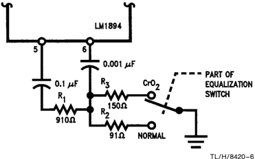

TL/H/8420-6

FIGURE 6. Optimizing the Control Path Threshold for Different Tape Formulations

Notice that only one additional resistor is required over the standard application, and it is easy to substitute transistor switching in place of the spdt switch.

$$R_1 / (R_1 + R_2) = 0.63 R_3 / (R_1 + R_3) \qquad (5)$$

### 2. TAPE DECKS WITH COMPLEMENTARY NOISE REDUCTION:

Most cassette decks available today employ some form of complementary (companding) noise reduction system, usually Dolby B Type. DNR can be used in conjunction with these noise reduction systems as a means to provide yet more noise reduction on decoded tapes and still provide noise reduction for unencoded tapes. The LM1894 is located after the companding system and provision must be made for the drop in noise level when the compandor is being used. The DNR threshold sensitivity is increased by the appropriate amount so that the lower noise levels are still able to activate the audio filters. For example, the circuit in Figure 7 shows a switching arrangement to compensate for the 9 dB lower noise floor from a Dolby B decoded tape. Notice the change in resistor values R 1 through R 3 to raise the sensitivity (yet keeping the sum of R 1 and R 2 to 1k) and the 9 dB pad formed by the 3 k X resistor and the 1.5 k X resistor in parallel with the control path input Pin 6, for use when the compandor is switched off. Since the output level from the compandor is usually around 580 mV for a flux density of 200 nW/m, the ratio of R1 to R2 and R3 is changed by only 5.6 dB compared to that shown in the previous Figure where the input level was 400 mVrms.

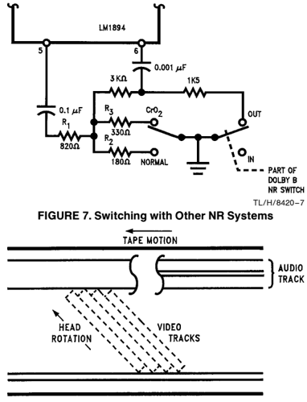

TL/H/8420-8

FIGURE 8. Video Magnetic Tape Format

### 3. VIDEO TAPE RECORDERS:

The audio track of a video cassette tape is similar to an audio cassette and appears along one edge of the tape. Although provision is made for two tracks, each 0.35 mm wide, a large number of recordings are monaural with a track width of 1 mm (0.04 inches).

Unlike the video heads, which are mounted on a rotating drum and angled to the direction of tape travel in order to give a much higher recording speed, the audio is recorded longitudinally with a separate head at 33.35 mm/sec for standard play, 16.88 mm/sec for long play, and 11.12 mm/sec for the very long play mode (VHS format tape machines). The noise spectrum is similar to an audio cassette but with a couple of differences. The typical frequency response from the head pre-amplifier does not extend beyond 10 kHz in the SP mode and is less in the LP and VLP modes. Even so, this bandwidth is enough to ensure the presence of the familiar tape ''hiss'' when played through modest or better Hi-Fi systems. Although the mono track width (twice as wide as an audio cassette stereo track) should help the S/N ratio, the slower tape speed does not, as shown in the curves of Figure 9. For the SP mode the S/N ratio is approximately 5 to 10 dB lower than the audio cassette and worsens by 3 to 5 dB in the extended play modes. Some ''spurs'' or ''spikes'' may be observed at harmonics of the video field frequency (60 Hz) and at the video line scan frequency of 15.734 kHz. The low frequency spikes will not affect DNR operation since the control path sensitivity decreases sharply below 1 kHz, but the presence of the 15.734 kHz component could cause improper sensitivity settings to be obtained. If this is the case, the pilot frequency notch filter for FM, described later, can be retuned by changing the capacitor from 0.015 mF to 0.022 m F.

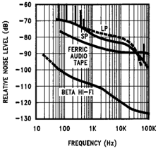

TL/H/8420-9

FIGURE 9. Video Tape Noise Spectrum Levels

Figure 9 also shows the noise spectrum with the new Beta Hi-Fi format. This is clearly superior to both the standard format and audio cassette tapes and is realized by using the two video record/play heads simultaneously for audio, thus taking advantage of the substantially higher relative tape speed. The audio is added in the form of four FM carriers, Figure 10. Four carriers are necessary for two audio channels since the azimuth loss between the normal video heads (reducing crosstalk between the heads at video frequencies) is not enough at the lower audio carrier frequencies. Each head therefore uses different carriers for the left and right channel signals.

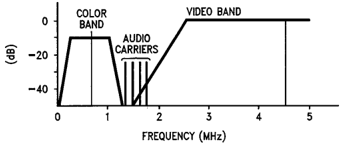

TL/H/8420-10

FIGURE 10. Beta Hi-Fi Carrier Frequencies

A quite different technique is used for VHS Hi-Fi, which is similar to that for 8 mm video. Separate audio heads are mounted on the same rotating drum that is carrying the video heads, but with a much larger azimuth angle compared to the video heads. The sound signal is written deep into the tape coating and then written over by the video signal which causes partial erasure of the audio-about a 10 dB to 15 dB loss. The difference in azimuth angle prevents crosstalk and the much greater writing speed still yields an S/N of over 80 dB.

Both Hi-Fi formats provide excellent sound quality with hardly any need for noise reduction but DNR can still play a role. Conventionally recorded tapes are and will be popular for quite a while, and even with Hi-Fi recording capability much recording will be done with television sound as a sourceand the source noise will dominate now instead of the tape noise. As discussed later, DNR can be very effective in dealing with television S/N ratios, allowing much of the benefit of improved recording techniques to be enjoyed.

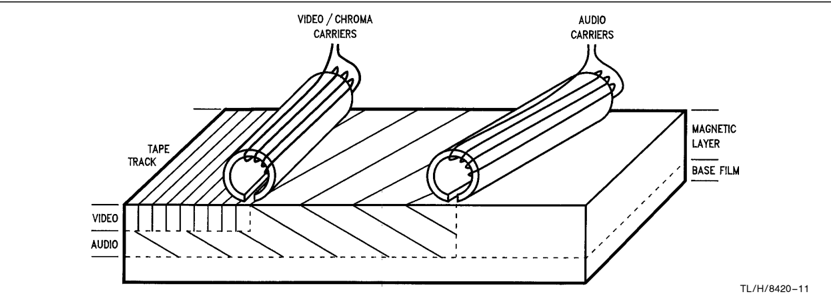

FIGURE 11. VHS Hi-Fi Recording Format

### 4. FM RADIOS:

FM sources can present special problems to DNR users. The presence of the 19 kHz stereo pilot tone can be detected in the DNR control path and cause improper threshold settings (the problem is not so much that the 19 kHz tone gives the wrong setting, but that if the threshold is adjusted with the tone present, then the threshold is wrong when the tone is absent-as in a monaural broadcast). Secondly, for FM broadcasts the noise level at the receiver detector output is dependent on the r.f. field strength when this field strength is under 100 mV/meter at the antenna terminal. With a fixed DNR threshold, as the noise level increases with decreasing field strength, the minimum audio bandwidth becomes wider and a loss in noise reduction is perceived. This latter problem occurs primarily with automobile radios where the signal strength can vary dramatically as the radio moves about. For the home receiver, re-adjustment of the DNR threshold setting for an individual station will compensate for the weaker signals.

To understand how much the pilot tone can affect the DNR control path, we can take a look at some typical signal levels. For an FM broadcast in the U.S., the maximum carrier deviation is limited to +-75 kHz with a pilot deviation that is 10% of this value. A high quality FM I/C such as the LM1865 will produce a 390 mVrms output at the detector with this peak deviation, so the pilot level at 19 kHz will be 39 mVrms. If the receiver does not include a multiplex filter, after de-emphasis 4 mV will appear at the inputs to the LM1894. Typically for FM signal noise floors, the resistive divider at Pin 5 will attenuate the pilot by 20 dB leaving 0.4 mVrms at Pin 6. This input level to the LM1894 control path is sufficient to cause the audio bandwidth to increase by over 1 kHz compared to the monaural minimum bandwidth. Of course, if the receiver does have a multiplex filter, which is common in high quality equipment or receivers that include Dolby B Type noise reduction, this problem will not happen, but otherwise we require an extra 15 dB to 20 dB attenuation at 19 kHz. This is obtained with a notch filter tuned to the pilot frequency connected between Pins 8 and 9 of the LM1894. Although a tuned inductor is shown, a fixed coil of similar inductance and Q can be used since with normal component value tolerances ( +-7% inductance, +-10% capacitance) the pilot tone will be attenuated by at least 15 dB.

Handling the signal strength dependence of the FM signal noise floor is not quite as easy - at least if pre-set DNR sensitivity settings are used. A look at the quieting curves for an FM radio will show why. At strong signal levels, greater than 1 mV/meter field strength at the antenna, the IF amplifier of the radio is in full limiting and the noise floor is between 60 dB and 80 dB below the audio signal. However, as the field strength starts to decrease below 1 mV/meter, the noise level begins to increase, even though the IF amplifier is still in limiting. Worse yet, since the demodulated output includes the noise from the stereo difference signal channel (L-R), the noise level is increasing more rapidly in the stereo mode than in the monaural mode. By the time the field strength has fallen to 100 mV/m the stereo noise is over 20 dB higher than the equivalent mono noise. If the DNR sensitivity is pre-set such that noise at the -45 dB to -55 dB level is activating the control path detector, when weaker stations are tuned in the noise level will increase and less noise reduction will be obtained. On the other hand, for stronger stations the noise level will drop below the detector threshold and a possibility exists that high frequency signals will be attenuated. Fortunately this latter occurrence is unlikely with commercial FM broadcasts since substantial signal compression is common, and the relatively high mid-band signals will be adequate enough to open the audio bandwidth sufficiently. In any event, with very strong r.f. signals, the need for noise reduction is minimal and DNR can be switched out.

| FM          | TV        |
|-------------|-----------|
| L 4.7mH     | 4.7mH     |
| C 0.015 m F | 0.022 m F |

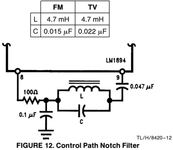

Recognizing that a fixed threshold setting is necessarily a compromise for FM, the designer can still elect to use a preset adjustment for convenience. The set-up procedure is a little more complicated than for an audio tape source and involves the use of an FM signal generator. The carrier frequency from the generator (between 88 MHz and 108 MHz) is unmodulated except for the stereo pilot tone, and the receiver is tuned to this carrier frequency. Then the carrier level is increased until the stereo demodulator output S/N ratio is that desired for the DNR threshold setting. For example, if the recovered audio output is 390 mVrms for 75 kHz deviation of the carrier frequency, the stereo noise level is 2.2 mVrms for a 45 dB S/N ratio. The generator level is increased until this noise voltage is measured at the demodulator output and the resistive divider at Pin 5 of the LM1894 adjusted correspondingly. A multiplex filter should be inserted between the decoder output and the S/N meter to prevent the pilot tone from giving an erroneous reading. At no time should the pilot tone be switched off since this will allow the decoder to switch into the nomaural mode, decreasing the noise level -65 dB instead. A S/N ratio of 45 dB is chosen since many modern receivers incorporate blending stereo demodulators. As the dashed curve of Figure 13 shows, when the stereo S/N ratio falls to 45 dB, the decoder starts to blend into monaural operation, thus keeping a constant S/N ratio. The loss in stereo separation that inevitably accompanies this blending is far less objectionable than abrupt switching from stereo to mono operation at weak signal levels.

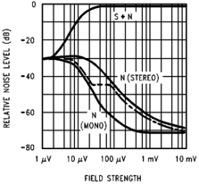

TL/H/8420-13

FIGURE 13. FM Radio Quieting Curves

### 5. TELEVISION RECEIVERS:

At first it might be thought that television broadcast signals, with an FM sound carrier located 4.5 MHz above the picture carrier frequency, will present the same difficulties as FM radio broadcasts to a DNR system with a pre-set threshold. This conclusion is modified by two considerations. First the TV receiver is unlikely to be mobile and the received signal strength will be relatively constant from an individual broadcast station. Secondly another subjective factor, the picture quality, will largely determine whether the signal strength is adequate enough for the viewer to stay tuned to that station. A representative television receiver will have a VHF Noise Figure between 6 dB and 7 dB such that, with a 75 X antenna impedance, the picture will be judged noise-free at an input signal level of just above 0.5 mVrms -i.e. a picture signal to noise ratio of 43 dB. Noise will become perceptible to most viewers at a S/N ratio of 38 dB and become objectionable at 28 dB to 30 dB. Therefore 13 dB below 1 mVrms the picture noise is objectionable, and at -25 dB to -30 dB it will probably be totally unacceptable to the majority of viewers. For off-air broadcasts, the audio carrier ampli- tude is 7 dB to 10 dB below the picture carrier amplitude and for cable services the typical sound/picture carrier ratio is -15 dB. However, due to the FM improvement factor (45.4 dB for equal amplitude carriers compared to the AM picture carrier) audio S/N ratios do not degrade as rapidly as the picture S/N-even with the lower audio carrier amplitudes.Figure 14 shows the increase in audio noise level as both carrier amplitudes are reduced from the picture carrier level that produces a noise-free picture. When the picture noise is already objectionable the audio noise level has remained virtually unchanged, even for an audio carrier 30 dB below the picture carrier. By the time an unacceptable picture noise level has been reached, the audio noise has increased by less than 3 dB for sound carriers at -10 dB and -20 dB relative to the picture carrier. Therefore it is unlikely that a perceptible increase in noise compared to a strong channel will occur before the viewer switches to another channel.

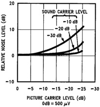

TL/H/8420-14

FIGURE 14. Increase in Audio Noise with Decreasing Carrier Levels

TL/H/8420-15 FIGURE 15. TV Noise Spectrum Level

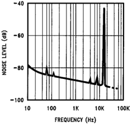

Figure 15 shows the noise spectrum level of a strong audio carrier (1 mVrms) referred to 7.5 kHz carrier deviation. The standard peak deviation in the U.S. is 25 kHz so that the spectrum level will be 10 dB lower when referred to the peak audio level, meaning that the noise is not much better than the cassette tape noise levels shown previously. Only the relatively small power capability and limited bandwidth of audio amplifiers and speakers in conventional receivers has made this noise level acceptable. Unfortunately for the listener who hooks up the audio to his Hi-Fi system, or buys a new receiver with wider audio bandwidth and high output power (in anticipation of the proposed BTSC stereo audio broadcasts for television), TV sound will exhibit this noise.

Because the noise floor will be relatively constant, a pre-set threshold can be used for the LM1894 control path (although broadcast of older movies with unprocessed and noisy optical soundtracks might increase the received noise), and the only modification to the standard application circuit is to shift the control path notch filter down to 15.734 kHz. This is done with sufficient accuracy simply by changing the 0.015 uF tuning capacitor to 0.022 uF.

Note: The introduction of a stereo audio broadcast (the BTSC-MCS proposal) does not substantially modify the above conclusions, even though dbx noise processing is used. The dbx-TV noise reduction is applied only to the new stereo difference signal channel (L-R) to decrease the additional noise intrinsic in the use of an AM subcarrier along with the normal (L a R) monaural channel. This means that the new stereo signal should have roughly the same characteristics as the present monaural signal.

### 6. MULTIPLE SOURCES:

Multiple sources are best accommodated by keeping the potentiometer in the LM1894 control path and allowing the user to optimize each source. Nevertheless, for convenience, pre-sets are often desired and these can be done in two ways.

- 1) If the sources have widely different S/N ratios, the resistive divider at Pin 5 should be tapped at the appropriate point for each source noise level. This assumes that the source signal levels have been matched at the input to the LM1894 for equal volume levels.
- 2) If the source S/N ratios are not too far different, then the input levels can be trimmed individually to produce the same noise level in the LM1894 control path. A single sensitivity setting is used, and an additional switch pole ganged to the source selector switch is avoided.

Examples of both arrangements are shown in Figure 16(a) and(b). To set up the multiple source system of 16(b) , the DNR control path sensitivity is adjusted for the source with the lowest noise floor. Measure the peak detector voltage (Pin 10) produced by this noise source and then switch to the next source. Adjust (attenuate) the input level of the new source to match the previous Pin 10 detector voltage and repeat this procedure for each subsequent source.

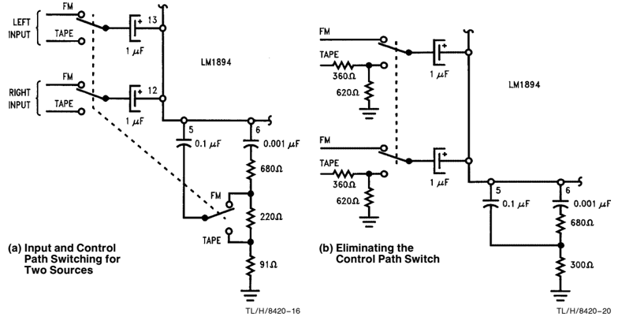

FIGURE 16. Multiple Programme Source Switching

### 7. CASCADING THE LM1894 AUDIO FILTERS

The LM1894 has two matched audio lowpass filters which can be cascaded, providing a single channel filter per I/C with a 12 dB/octave roll-off. This produces slightly more noise reduction (up to 18 dB) but because the steeper filter slope may in some cases produce audible effects on high frequency material, cascaded filters are best used for sources with a relatively restricted h.f. content. When the filters are cascaded the combined corner frequency decreases by 64% according to Equation (6), for n = 2

$$f_c = f_0 \sqrt{10^{0.3/n} - 1}$$

Therefore, to retain the original frequency range, the capacitor values must be reduced by the same factor to 0.0022 uF. One of the audio outputs is connected over to the other audio filter input and the summing amplifier in the control path is by-passed by moving the 0.1 uF coupling capacitor from Pin 5 over to the single audio input. If the audio source is unable to drive the 1kOhm impedance of the control path input network, this can be scaled up by using a 0.01 uF capacitor and a 10kOhm potentiometer.

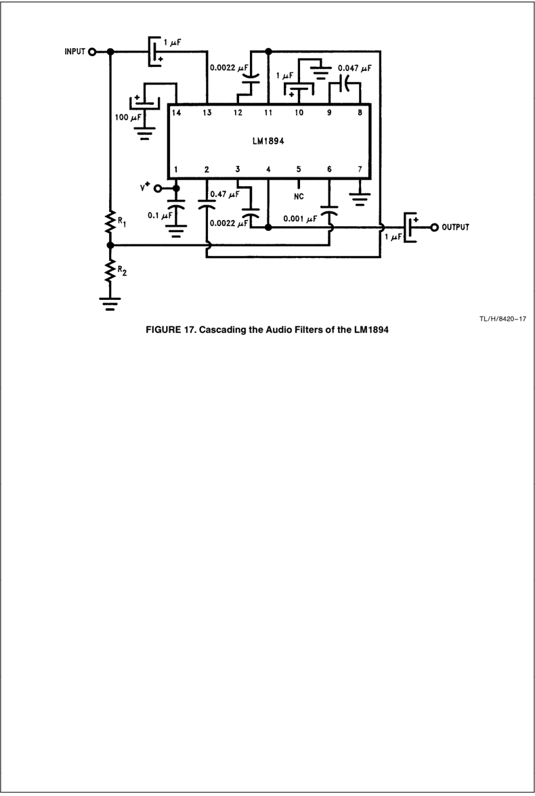

FIGURE 17. Cascading the LM1894 Audio Filters

## LIFE SUPPORT POLICY

NATIONAL'S PRODUCTS ARE NOT AUTHORIZED FOR USE AS CRITICAL COMPONENTS IN LIFE SUPPORT DEVICES OR SYSTEMS WITHOUT THE EXPRESS WRITTEN APPROVAL OF THE PRESIDENT OF NATIONAL SEMICONDUCTOR CORPORATION. As used herein:

1. Life support devices or systems are devices or systems which, (a) are intended for surgical implant into the body, or (b) support or sustain life, and whose failure to perform, when properly used in accordance with instructions for use provided in the labeling, can be reasonably expected to result in a significant injury to the user.

2. A critical component is any component of a life support device or system whose failure to perform can be reasonably expected to cause the failure of the life support device or system, or to affect its safety or effectiveness.

National Semiconductor Corporation

## National Semiconductor

## National Semiconductor Hong Kong Ltd.

National Semiconductor

Europe

Japan Ltd.

1111 West Bardin Road Arlington, TX 76017 Tel: 1(800) 272-9959 Fax: 1(800) 737-7018

Fax:

( a 49) 0-180-530 85 86

13th Floor, Straight Block, Ocean Centre, 5 Canton Rd. Tsimshatsui, Kowloon Hong Kong

Tel:

81-043-299-2309

Email: cnjwge @ tevm2.nsc.com

Fax: 81-043-299-2408

Deutsch

Tel:

( a 49) 0-180-530 85 85 ( a 49) 0-180-532 78 32

English

Tel:

Fran

3

ais

Tel:

( a

49) 0-180-532 93 58

Tel: (852) 2737-1600

Italiano

Tel:

( a 49) 0-180-534 16 80

Fax: (852) 2736-9960