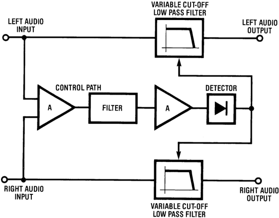
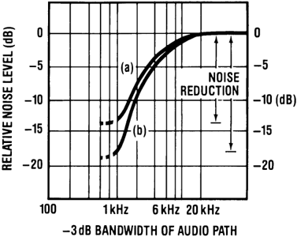
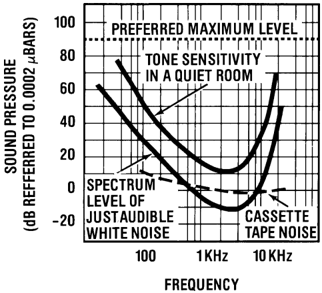
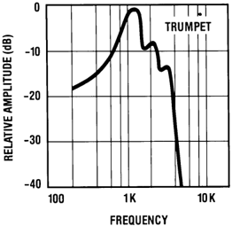
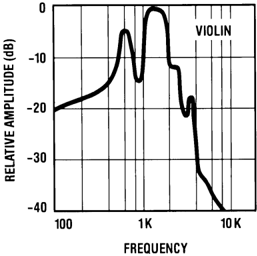
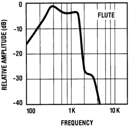
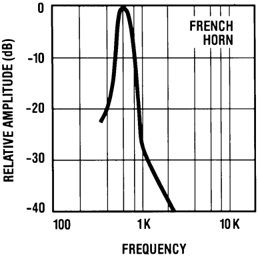
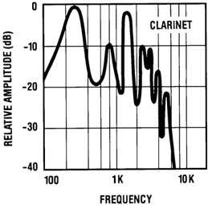
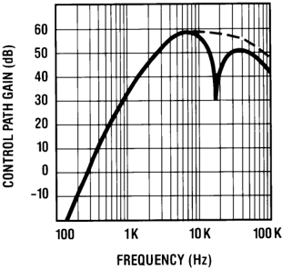
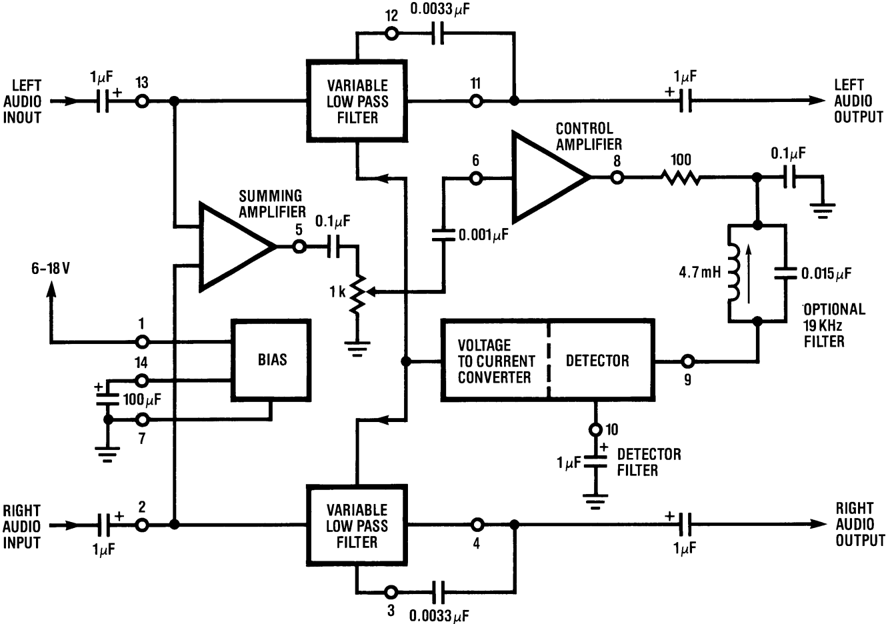

# Application Report

SNAA089C-March 1985-Revised May 2013

AN-384 Audio Noise Reduction and Masking

## ABSTRACT

This application report discusses audio noise reduction and masking.

## 1 Introduction

Audio noise reduction systems can be divided into two basic approaches. The first is the complementary type which involves compressing the audio signal in some well-defined manner before it is recorded (primarily on tape). On playback, the subsequent complementary expansion of the audio signal which restores the original dynamic range, at the same time has the effect of pushing the reproduced tape noise (added during recording) farther below the peak signal level-and hopefully below the threshold of hearing.

The second approach is the single-ended or non-complementary type which utilizes techniques to reduce the noise level already present in the source material-in essence a playback only noise reduction system. This approach is used by the LM1894 integrated circuit, designed specifically for the reduction of audible noise in virtually any audio source.

While either type of system is capable of producing a significant reduction in audible noise levels, compandors are inherently capable of the largest reduction and, as a result, have found the most favor in studio based equipment. This would appear to give compandors a distinct edge when it comes to translating noise reduction systems from the studio or lab to the consumer marketplace. Compandors are not, unfortunately, a complete solution to the audio noise problem. If we summarize the major desirable attributes of a noise reduction system we will come up with at least eight distinct things that the system must do-and no system as yet does all of them perfectly.

- The reproduced signal (now free of noise) is audibly identical to the original signal in terms of frequency response, transient response and program dynamics. The stereo image is stable and does not wander.
- Overload characteristics of the system are well above the normal peak signal level
- The system electronics do not produce additional noise (including perturbations produced by the control signal path).
- Proper response of the system does not depend on phase/frequency or gain accuracy of the transmission medium.
- System operation does not cause audible modulation of the noise level.
- The system enables the full dynamic range of the source to be utilized without distortion.
- The recorded signal sounds natural on playback-even when decoding is not used. This means that the system is compatible with existing equipment.
- Finally, the system is universal and can be used with any medium; disc, FM broadcast, television broadcast, audio and video tapes.

Figure 1. Comparison of Noise Reduction Systems

Although no system presently meets all these requirements-and the performance level they do reach is often judged subjectively-they provide a useful set of performance standards by which to judge the n.r. systems that are available. In particular, in the consumer field items 7) and 8) are significant. The most popular n.r. system, Dolby B Type, got that way in part because pre-recorded and encoded tapes could be played back on tape-decks that did not have Dolby B decoders (Dolby B uses a relatively small amount of compression and that only for low level higher frequency signals). Similarly, DNR™ , which uses the LM1894, is gaining in popularity because it does not require any encoding and, in addition, can work with any audio source, including Dolby B encoded tapes.

DNR is a non-complementary noise reduction system which can give up to 14 dB noise reduction in stereo program material. The operation of the LM1894 is dependent on two principles; that the audible noise is proportional to the system bandwidth-decreasing the bandwidth decreases the noise-and that the desired signal is capable of 'masking' the noise when the signal to noise ratio is sufficiently high. DNR automatically and continuously changes the system bandwidth in response to the amplitude and frequency content of the program. Restricting the bandwidth to less than 1 kHz reduces the audible noise by up to 14 dB (weighted) and a special spectral weighting filter in the control path ensures that the bandwidth is always increased sufficiently to pass any music that may be present. Because of this ability to analyze the auditory masking qualities of the program material, DNR does not require the source to be encoded in any special way for noise reduction to be obtained.

Figure 2. Stereo Noise Reduction System (DNR)

## 2 Noise Reduction by Bandwidth Restriction

The first principle upon which DNR is based-that a reduction in system bandwidth is accompanied by a reduction in noise level-is rather easy to show. If our system noise is assumed to be caused solely by resistive sources then the noise amplitude will be uniform over the frequency bandwidth. The total or aggregate noise level e NT is given by the familiar formula

$$\overline{e_{NT}} = \sqrt{4KTBR}$$

- K = Boltzmanns cons't
- T = absolute temp.
- B = bandwidth
- R = source resistance

At any single frequency, the noise amplitude measured in a bandwidth of 1 Hz is e n , and therefore

$$\overline{e_{NT}} = \overline{e_n} \sqrt{B}$$

This shows that the total noise, and hence the S/N ratio, is directly proportional to the square root of the system bandwidth. For example, if the system bandwidth is changed from 30 kHz to 1 kHz, the aggregate S/N ratio changes by

$$20 \log_{10}\sqrt{1 \times 10^3} - 20 \log_{10}\sqrt{30 \times 10^3} = -14.8 \text{ dB}$$

This result, although mathematically correct, is not exactly what will occur in practice for several reasons. Most audio systems will have a generally smooth noise spectrum similar to white noise, but the amplitude is not necessarily uniform with frequency. In audio cassette systems where the dominant noise source is the tape itself, the frequency response often falls off rapidly beyond 12 kHz anyway. For video tapes with very slow longitudinal audio tracks, the frequency response is well below 10 kHz, depending on the recording mode. Disc noise generally increases towards the low frequency end of the audio spectrum whereas FM broadcast noise decreases below 2 kHz. On the other hand, the frequency range of the noise spectrum is not always indicative of its obtrusiveness. The human ear is most sensitive to noise in the frequency range from 800 Hz to just above 8 kHz. Because of this, a weighting filter inserted into the measurement system which gives emphasis to this frequency range, produces better correlation between the S/N 'number' and the subjective impression of noise audibility. Generally speaking, a typical tape noise spectrum and a weighting filter such as CCIR/ARM will yield noise reduction numbers between 10-14 dB when a single pole low pass filter is used to restrict the audio bandwidth to less than 1 kHz. Up to 18 dB noise reduction is possible with a two pole low pass filter. Consistent with the many reported experiments on ear sensitivity (Fletcher-Munson, Robinson-Dadson etc.) we see that decreasing the bandwidth below 800 Hz is not particularly beneficial, and that once the bandwidth is above 8 kHz, there is little perceived increase in the audible noise level.

Figure 3. Reduction in Noise Level with Decreasing Bandwidth Audio Cassette Tape Noise SourceCCIR/ARM Weighted a) single pole low pass filter; b) two pole low pass filter

## 3 Auditory Masking

Obviously restricting the system bandwidth to less than 1 kHz in order to reduce the noise level will not be very satisfactory if the program material is similarly restricted, and this is where the second operating principle of DNR comes into play-whenever a sound is being heard it reduces the ability of the listener to hear another sound. This is known as auditory masking and is not a newly discovered phenomenon. It has been investigated for many years, primarily in connection with noise masking the ability of the listener to hear tones. The measurements have been made under steady state conditions and are summarized in the curves of Figure 4. Before discussing the shape of the curves and the conclusions that can be drawn it is worth looking at the scales employed. One difficulty that occurs in evaluating electronic equipment for audio is to be able to relate a quantity measured in electrical terms to the subjective stimulus (hearing) that it produces. For audio we are most interested in the conversion of electrical power into acoustic power. Since neither sound power nor sound intensity can be measured directly, we must use a related quantity known as sound pressure level (SPL) as our reference scale in Figure 4. The reference sound pressure, which approximates the threshold of hearing at 1 kHz is 0.0002 μBars (10^6 μBars = 1 Bar = 1 atmosphere). For this sound pressure scale, the level at which noise spectra will appear depends on the degree of amplification we are giving the desired signal to produce the maximum anticipated sound pressure. Typically a maximum preferred listening level is +90dB (SPL) and the assumption is made that the total audio system, including speakers, is producing this SPL at the listener's ear when the recorded level (on tape, for example) corresponds to 0 VU. By comparing the amplitude of noise spectra with this OVU level signal we obtain the tape noise curves of Figure 4 and can compare them with the audible noise threshold. Increasing the volume level by 10 dB (say), to compensate for a lower recording level will raise all the noise spectra curves by 10 dB. The audible noise threshold curve does not change with changes in SPL produced by twiddling the volume control (except after prolonged listening at high levels) since it depends on the characteristics of the ear and partly upon the masking effects of room noise.

Figure 4. Relating the Spectral Sensitivity of the Ear to Tones and Audible Noise with the Noise Output Level from an Electric Source

The upper solid curve in Figure 3 shows the sensitivity of the ear to pure tones in a typical room environment. Notice that tones at very low frequencies and at very high frequencies must be much louder than tones at mid-frequencies in order to be heard. The lower solid curve shows the spectrum level of just audible white noise. This curve is some 20 dB-30 dB below the tone spectrum because, unlike a single tone, noise has spectral components at all frequencies. Noise spectra at frequencies either side of a specific frequency contribute to the auditory sensation and thus can be heard at a lower threshold level. The two curves also imply that noise at or above the lower curve is able to completely mask single tones on the upper curve. Also sources with noise spectra above the lower curve are going to be audible. Clearly for cassette tapes we need to push the noise level down by another 10 dB if it is to be inaudible at preferred listening levels. If the tape is under-recorded and the volume level increased to compensate, yet more noise reduction is needed.

Reversing these conclusions to determine the ability of tones to mask the noise is not as easy. The hearing mechanism in the ear involves the basilar membrane which is approximately 30 mm long by 0.5 mm wide. The nerve endings giving the sensation of hearing are spaced along this membrane so that the ability to hear at one frequency is not masked at another frequency when the frequencies are well separated. White noise can excite the entire basilar membrane since it has spectral components at all frequencies. For any single frequency therefore, there will be a band of noise spectra capable of simultaneously exciting the nerve endings that are responding to the single frequency-and masking occurs. Conversely, a single tone at the upper curve level is quite incapable of masking noise spectra at the lower curve level snce it can only excite nerve endings at one particular point on the membrane. Noise spectra at frequencies on either side of the tone will still excite different parts of the membrane-and will be heard. Extremely high SPL's are required if single tones are to raise the audible noise threshold level and provide masking. As might be expected, the most effective tone frequencies are near the natural resonance of the ear-between 700 Hz and 1 kHz-and even then SPL's higher than 75 dB are needed for masking noise at 16 dBSPL. Fortunately for n.r. systems in general, including compandors, this applies only to pure tones. As soon as the tone acquires distortion, frequency modulation or transient qualities, or a mixture of tones is present, the masking abilities change dramatically. Typically music and speech, with high energy concentration around 1 kHz, can be regarded as excellent noise masking sources-up to 30 dB more effective than single tones. Therefore, recorded signals at an average level of 40-45 dB SPL will allow a full audio bandwidth to be used without the noise becoming audible. Signal levels lower than this can provide adequate masking, particularly if the source has employed dynamic range compression (FM broadcast for example), but speech and solo musical instruments are likely to betray noise modulation. These conclusions can apply equally to complementary noise reduction systems with the noise modulation effects depending on the degree of compression/expansion and the threshold level at which compression begins in the record chain.

## 4 Control Path Filtering and Transient Characteristics

If the signal source always maintained a relatively high SPL, then there wouldn't be any need for an n.r. system. However, when the program material SPL momentarily drops, the noise is unmasked and becomes audible. Much of the design effort involved in n.r. systems is in making the system track the program dynamics so that unmasking does not occur-at least not audibly. Similarly when the program material increases abruptly following a quiet passage, the n.r. system must respond quickly enough that the audio material is not distorted. For DNR, this means that the -3 dB corner frequency of the low pass filters inserted in each audio channel must increase quickly enough to pass all the music yet decrease back to around 1 kHz in the absence of music to reduce the noise. Matching low pass filters are used with a flat response below the cut-off frequency, and a smoothly decreasing response ( -6 dB/octave) above the cut-off frequency, which can be varied from 800 Hz to over 30 kHz by the control signal.

A first approach to generating this control signal might be to use a filter and a gain block, driving a peak detector circuit. Since the amplitude spectra of musical instruments falls off with increasing frequency, and the characteristics of the ear are such that masking is most effective with sounds around 1 kHz, a reasonable filter for the control path might be low pass. This turns out not to be the case. To take a worse case situation (from the viewpoint of masking), when a French Horn is the dominant source, most of the energy is at frequencies below 1 kHz. If we were detecting this energy through a low pass filter, the control path would respond to the high amplitude and cause the audio filters to open to full bandwidth. Noise in the 2 kHz and above region would be promptly unmasked and audible. To avoid this, DNR uses a highpass filter in the control path. Below 1.6 kHz, the response falls at an 18 dB/octave rate. Above 1.6 kHz the filter response increases at a 12 dB/octave rate until a -3 dB corner frequency around 6 kHz is reached. After this the response is allowed to drop again and may include notches at 15.734 kHz (for television sound), or at 19 kHz to suppress the subcarrier pilot signal in FM stereo broadcasts. Returning to the case of the French Horn, the absence of high amplitude higher frequency harmonics means that the control signal will generate only a small increase in the audio bandwidth (depending on the sound level) and the noise will remain filtered out.

Contrasted with this, multiple instruments, or solo instruments such as the violin or trumpet, can have significant energy levels above 1 kHz which not only provide masking at higher frequencies but also require wider audio bandwidths for fidelity transmission in the audio path. Put another way, when the presence of high frequencies is detected in the control path we know that the audio bandwidth must be increased and that simultaneously large levels of signal energy are present in the critical masking frequency range. Since the harmonic amplitude can decrease rapidly with increase in frequency, the control sensitivity is raised at a 12 dB/octave rate up to 6 kHz to ensure that an adequate audio bandwidth is always maintained.

The attack and release times of the control path signal are also based on typical program dynamics and the characteristics of the human ear. If the detector cannot respond to the leading edge transient in the music, then distortion in the audio path will result from the initial loss of high frequency components. As might be expected, the rise time of any musical selection will depend on the instruments that are being played. An English Horn is capable of reaching 60% of its peak amplitude in 5 ms. For other instruments, rise-times can vary from 50 ms to 200 ms whereas a hand-clap can be as fast as 0.5 ms. With this data in mind, DNR has been designed with an attack time of 0.5 ms. A distinction should be made in the effects of longer attack times for DNR compared to a companding noise reducer. If the compander does not respond immediately to an input transient, then instantaneous overload of the audio path can occur, with an overshoot amplitude as much as the maximum compression capability. If the system does not have adequate headroom, this overshoot can cause audible effects that last for longer than the period of the overshoot. The DNR filters simply cannot produce such an overshoot by failure to respond to the input rise-time. Since the ear has difficulty registering sounds of less than 5 ms duration, and can tolerate severe distortion if it lasts less than 10 ms, DNR has considerable flexibility in the choice of detector attack time.

Attack time is only half the story. Once the detector has responded to a musical transient, it needs to decay back to the quiescent output level at the cessation of the transient. A slow decay time would mean that for a period following the end of the transient, the system audio bandwidth would still be relatively wide. The noise in this bandwidth would be unmasked and a noise 'burst' heard at the end of each musical transient. Conversely, if the release time is short to ensure a rapid decrease in bandwidth, a loss in musical 'ambience' will occur with the suppression of harmonics at the end of a large signal transient. To avoid this, DNR uses a natural decay to within 10% of the final value in 60 ms. The inability of the ear to recover for 100 ms to 150 ms following a loud sound prevents the noise that is present (until the bandwidth is closed down) from being heard. Again a contrast with compander action is appropriate. As the DNR detector control voltage decays, the bandwidth starts to diminish, Initially only high frequencies are affected and since the harmonic amplitude of the signal is also decaying rapidly, the audio is unaffected by this decrease in bandwidth. For a compander however, as the control voltage decays, the system gain is altered-which also affects the signal mid-band and low frequency components. Thus, as with attack times, DNR is substantially less affected by the choice of release times, permitting a high tolerance in component values.

Figure 5. With Most Musical Instruments, as well as Speech, Energy is Concentrated around 1 kHz with a Rapid Fall-Off in Level Above 6 kHz

## 5 Circuit Operation

The entire DNR system is contained within a single I/C and consists of two main functional signal paths. The audio path includes two low distortion low pass filters for a stereo audio source and the control path has a summing amplifier, variable gain filter amplifier and a peak detector. These functions are combined as shown in Figure 7 which also shows the typical external components required for a complete n.r. system. By low distortion, we mean a filter that maintains the same cut-off slope and does not peak at the corner frequency as this frequency is changed. A 6 dB/octave filter slope was chosen since this provides a reasonable amount of noise reduction when the -3 dB frequency is less than 2 kHz and does not audibly affect the program material when the control path threshold is correctly set. It is possible to cascade the two audio filters-with a corresponding reduction in the size of the feedback capacitors to maintain the same operating frequency range-for a 12 dB/octave slope and up to 18 dB noise reduction. However, this steeper roll-off characteristic is better suited for program material that is relatively deficient in high frequency content, early recordings or video tapes for example.

Each audio filter consists of a variable transconductance stage driving an amplifier with capacitative feedback. For a fixed capacitor value, as the transconductance is changed by the control signal, the open loop unity gain frequency is changed correspondingly, giving a variable corner frequency low-pass filter. Of particular importance in the design is the need to avoid voltage offsets at the filter output caused by control action, and the ability of the input stage to accommodate large signal swings without introducing distortion. Output offset voltages are not necessarily proportional to the change in control voltage but will, in any case, be accompanied by a significant change in the program level. Extensive listening tests have shown that offset voltages 26 dB or more below the nominal signal input level will not be heard. Overload capability is dependent on the input stage current level and the available supply voltage, but even with an 8 VDC supply the LM1894 can handle signals more than 20 dB over the nominal input level without increased distortion.

Figure 6. Control Path Characteristic (Including Optional 19 kHz Notch)

Figure 7. DNR System with Recommended Circuit Values

A summing amplifier is used at the input to the control path so that both left and right audio channels contribute to the control signal. Both audio filters are controlled with the same signal yielding matched audio bandwidths and maintaining a stable stereo image. From the summing amplifier the signal passes through a high-pass filter formed by the coupling capacitor and a 1 k Ω potentiometer. These components produce an amplitude roll-off below 1.6 kHz to avoid control path overload and help prevent high level, low frequency signals (drum beats for example) from activating the detector unnecessarily. The potentiometer provides a means to adjust the overall gain of the control path such that the input source noise level is able to just cross the detector threshold and begin opening the audio bandwidth. The correct adjustment point is one that permits alternate use and bypass of the DNR system with no audible change in the program material-other than reduction of background noise. Also, on more difficult program material where the S/N ratio is so poor that masking is not completely effective, the potentiometer can be set to limit the maximum audio bandwidth so that noise pumping is avoided. For systems with a predictable noise level such as cassette recorders, the potentiometer can be replaced by two suitable fixed resistors. Further filtering of the control signal is done at the input to the gain stage and at the input to the detector stage. The input capacitors to these stages form high pass filters with internal resistors and are cascaded for a combined corner frequency (-3 dB) of around 6 kHz. Finally the detector attack and release times are set to the previously described values by an external capacitor connected to the peak detector output.

This application report has described the DNR non-complementary noise reduction system in terms of the functional blocks and the psychocoustic background necessary to understand the operating principles. For a more complete circuit description and practical details on the use of the LM1894, see the data sheet and the AN-386 A Non-Complementary Audio Noise Reduction System Application Report ([SNOA670](https://www.ti.com/lit/an/snoa670c/snoa670c.pdf)). Note that DNR is a trademark of Texas Instruments and that use of the DNR logo is by license agreement only.

## 6 References

- 'Speech and Hearing in Communication', Fletcher, Von Nostrand, 1953
- 'Absolute Amplitudes and Spectra of Certain Musical Instruments and Orchestras', Sixian et al, JASA, Vol. 2, #1
- 'The Masking of Pure Tones and Speech by White Noise', Hawkins and Stevens, JAES, Vol. 22, #1.
- 'Loudness, Masking, and Their Relation to the Hearing Process and the Problem of Noise Measurement', Fletcher, JASA, Vol. 9, #4.
- 'Models of Hearing', Schroeder, Proc. IEEE, Vol. 63, #9.
- 'Masking and Discrimination', Bos and DeBoer, JAES, Vol. 39, #4.
- 'CCIR/ARM: A Practical Noise Measurement Method', Dolby et al, JAES, 1978.
- "A Best Buy Denoiser', High Fidelity, May, 1981.
- 'On-chip Stereo Filter Cuts Noise Without Pre-Processing Signal', Giles, Electronics, Aug., 1981.
- 'A Non-Complementary Audio Noise Reduction System', Giles and Wright, IEEE Trans on Consumer Electronics, Vol. CE-27, #4.

## IMPORTANT NOTICE

Texas Instruments Incorporated and its subsidiaries (TI) reserve the right to make corrections, enhancements, improvements and other changes to its semiconductor products and services per JESD46, latest issue, and to discontinue any product or service per JESD48, latest issue. Buyers should obtain the latest relevant information before placing orders and should verify that such information is current and complete. All semiconductor products (also referred to herein as 'components') are sold subject to TI's terms and conditions of sale supplied at the time of order acknowledgment.

TI warrants performance of its components to the specifications applicable at the time of sale, in accordance with the warranty in TI's terms and conditions of sale of semiconductor products. Testing and other quality control techniques are used to the extent TI deems necessary to support this warranty. Except where mandated by applicable law, testing of all parameters of each component is not necessarily performed.

TI assumes no liability for applications assistance or the design of Buyers' products. Buyers are responsible for their products and applications using TI components. To minimize the risks associated with Buyers' products and applications, Buyers should provide adequate design and operating safeguards.

TI does not warrant or represent that any license, either express or implied, is granted under any patent right, copyright, mask work right, or other intellectual property right relating to any combination, machine, or process in which TI components or services are used. Information published by TI regarding third-party products or services does not constitute a license to use such products or services or a warranty or endorsement thereof. Use of such information may require a license from a third party under the patents or other intellectual property of the third party, or a license from TI under the patents or other intellectual property of TI.

Reproduction of significant portions of TI information in TI data books or data sheets is permissible only if reproduction is without alteration and is accompanied by all associated warranties, conditions, limitations, and notices. TI is not responsible or liable for such altered documentation. Information of third parties may be subject to additional restrictions.

Resale of TI components or services with statements different from or beyond the parameters stated by TI for that component or service voids all express and any implied warranties for the associated TI component or service and is an unfair and deceptive business practice. TI is not responsible or liable for any such statements.

Buyer acknowledges and agrees that it is solely responsible for compliance with all legal, regulatory and safety-related requirements concerning its products, and any use of TI components in its applications, notwithstanding any applications-related information or support that may be provided by TI. Buyer represents and agrees that it has all the necessary expertise to create and implement safeguards which anticipate dangerous consequences of failures, monitor failures and their consequences, lessen the likelihood of failures that might cause harm and take appropriate remedial actions. Buyer will fully indemnify TI and its representatives against any damages arising out of the use of any TI components in safety-critical applications.

In some cases, TI components may be promoted specifically to facilitate safety-related applications. With such components, TI's goal is to help enable customers to design and create their own end-product solutions that meet applicable functional safety standards and requirements. Nonetheless, such components are subject to these terms.

No TI components are authorized for use in FDA Class III (or similar life-critical medical equipment) unless authorized officers of the parties have executed a special agreement specifically governing such use.

Only those TI components which TI has specifically designated as military grade or 'enhanced plastic' are designed and intended for use in military/aerospace applications or environments. Buyer acknowledges and agrees that any military or aerospace use of TI components which have not been so designated is solely at the Buyer's risk, and that Buyer is solely responsible for compliance with all legal and regulatory requirements in connection with such use.

TI has specifically designated certain components as meeting ISO/TS16949 requirements, mainly for automotive use. In any case of use of non-designated products, TI will not be responsible for any failure to meet ISO/TS16949.

## Products

## Applications

|   |    |     |     |
|------------------------------ |--------------------------------- |--------------------------------- |----------------------------------- |
| Audio                        | [www.ti.com/audio](https://www.ti.com/audio)                | Automotive and Transportation   | [www.ti.com/automotive](https://www.ti.com/automotive)             |
| Amplifiers                   | [amplifier.ti.com](https://amplifier.ti.com)                | Communications and Telecom      | [www.ti.com/communications](https://www.ti.com/communications)         |
| Data Converters              | [dataconverter.ti.com](https://dataconverter.ti.com)            | Computers and Peripherals       | [www.ti.com/computers](https://www.ti.com/computers)              |
| DLP® Products                | [www.dlp.com](https://www.dlp.com)                     | Consumer Electronics            | [www.ti.com/consumer-apps](https://www.ti.com/consumer-apps)          |
| DSP                          | [dsp.ti.com](https://dsp.ti.com)                      | Energy and Lighting             | [www.ti.com/energy](https://www.ti.com/energy)                 |
| Clocks and Timers            | [www.ti.com/clocks](https://www.ti.com/clocks)               | Industrial                      | [www.ti.com/industrial](https://www.ti.com/industrial)             |
| Interface                    | [interface.ti.com](https://interface.ti.com)                | Medical                         | [www.ti.com/medical](https://www.ti.com/medical)                |
| Logic                        | [logic.ti.com](https://logic.ti.com)                    | Security                        | [www.ti.com/security](https://www.ti.com/security)               |
| Power Mgmt                   | [power.ti.com](https://power.ti.com)                    | Space, Avionics and Defense     | [www.ti.com/space-avionics-defense](https://www.ti.com/space-avionics-defense) |
| Microcontrollers             | [microcontroller.ti.com](https://microcontroller.ti.com)          | Video and Imaging               | [www.ti.com/video](https://www.ti.com/video)                  |
| RFID                         | [www.ti-rfid.com](https://www.ti-rfid.com)                 |                                 |                                   |
| OMAP Applications Processors | [www.ti.com/omap](https://www.ti.com/omap)                 | TI E2E Community                | [e2e.ti.com](https://e2e.ti.com)                        |
| Wireless Connectivity        | [www.ti.com/wirelessconnectivity](https://www.ti.com/wirelessconnectivity) |      |                                   |

Mailing Address: Texas Instruments, Post Office Box 655303, Dallas, Texas 75265 Copyright © 2013, Texas Instruments Incorporated