# Application Report

SNOA670C-March 1985-Revised May 2013

 AN-386 A Non-Complementary Audio Noise Reduction System

.....................................................................................................................................................

## ABSTRACT

The popularity of companding or complementary noise reduction systems is self-evident. Nearly all medium to high quality cassette tape decks include either Dolby ® B or Dolby C type noise reduction. A scant few have different systems such as dbx or Hi-Com. The universal appeal of compandors to n.r. system designers is the amount of noise reduction they can offer, yet one of the major reasons the Dolby B system gained dominance in the consumer marketplace is because it offered only a limited degree of noise reduction - just 10 dB. This was sufficient to push cassette tape noise down to the level where it became acceptable in good-quality applications, yet wasn't enough that undecoded playback on machines not equipped with a Dolby B system was unsatisfactory - quite the contrary, in fact. The h.f. boost on Dolby B encoded tapes when reproduced on systems with modest speakers was frequently preferred. Since companding systems are so popular, it is not unreasonable to ask, 'why do we need another noise reduction system?'

Dolby is a registered trademark of Dolby Laboratories. All other trademarks are the property of their respective owners.

## 1 Introduction

For many of the available audio sources today, compandors are not a solution for audio noise. When the source material is not encoded in any way and has perceptible noise, complementary noise reduction is not possible. This includes radio and television broadcasts, the majority of video tapes and of course, older audio tape recordings and discs. The DNR single-ended n.r. system has been developed specifically to reduce noise in such sources. A single-ended system able to provide noise reduction where none previously existed and avoid compatibility restraints or the imposition of yet another recording standard for consumer equipment is, therefore, attractive.

The DNR system can be implemented by either of two integrated circuits, the LM1894 or the LM832, both of which can offer between 10 and 14 dB noise reduction in stereo program material. Although differing in some details (the LM832 is designed for low-signal, low-supply voltage applications) the operation of the integrated circuits is essentially the same. Two basic principles are involved; that the noise output is proportional to the system bandwidth, and that the desired program material is capable of 'masking' the noise when the signal-to-noise ratio is sufficiently high. DNR automatically and continuously changes the system bandwidth in response to the amplitude and frequency content of the program. Restricting the signal bandwidth to less than 1 kHz reduces the audible noise and a special spectral weighting filter in the control path ensures that the audio bandwidth in the signal path is always increased sufficiently to pass any music that may be present. Because of this ability to dynamically analyze the auditory masking qualities of the program material, DNR does not require the source to be encoded in any special way for noise reduction to be obtained. This application report deals with the design and operating characteristics of the LM1894. For a more complete description of the principles behind the DNR system, see AN-384 Audio Noise Reduction and Masking (SNAA089).

## 2 The DNR System Format

A block diagram showing the basic format of the LM1894 is shown in Figure 1. This is a stereo system with the left and right channel audio signals each being processed by a controlled cut-off frequency (f -3 dB) low-pass filter. The filter cut-off frequency can be continuously and automatically adjusted between 800 Hz and 35 kHz by a signal developed in the control path. Both audio inputs contribute to the control path signal and are used to activate a peak detector which, in turn, changes the audio filters' cut-off frequency. The audio path filters are controlled by the same signal for equally matched bandwidths in order to maintain a stable stereo image.

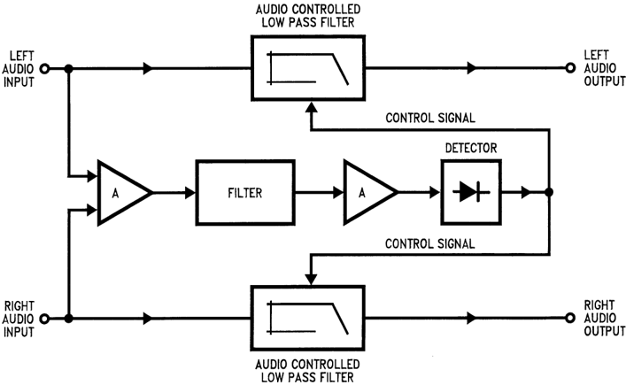

Figure 1. Stereo Noise Reduction System (DNR)

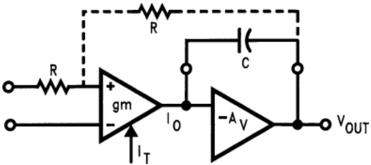

Figure 2. (a) Variable Lowpass Filter

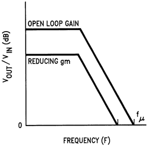

Figure 3. (b) Open Loop Response

Figure 5. Variable Cut-Off Low Distortion Filters

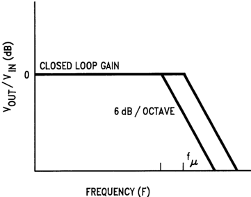

Figure 4. (c) Closed Loop Response

## 3 Variable Cut-Off Low Distortion Filters

Low distortion means a filter that has a flat response below the cut-off frequency, a smooth, constant attenuation slope above the cut-off frequency and does not peak at the cut-off frequency as this frequency is changed.

The circuit topology is shown in Figure 5 (a) and is, in fact, very similar to the pole-splitting frequency compensation technique used on many integrated circuit operational amplifiers (see pp. 24-26 of 'Intuitive I/C Op Amps' by T. M. Fredericksen). A variable transconductance (g m) stage drives an amplifier configured as an integrator. The transconductance stage output current $I_o$ is given by:

$$I_o = g_m V_{in} \qquad (1)$$

and, if the second amplifier is considered ideal, then the voltage $V_{out}$ is the result of $I_o$ flowing through the capacitative reactance of $C$. Therefore, Equation 2 is written as:

$$V_{out} = \frac{I_o}{2 \pi f C} \qquad (2)$$

Combining Equation 1 and Equation 2, you have:

$$\frac{V_{out}}{V_{in}} = \frac{g_m }{2 \pi f C} \qquad (3)$$

At some frequency, the open loop gain will fall to unity (f=f u ) given by:

$$f_u = \frac{g_m}{2\pi C} \qquad (4)$$

For a fixed value of capacitance, when the transconductance changes, then the unity gain frequency changes accordingly as shown in Figure 5 (b).

If you put dc feedback around both stages for unity closed loop gain, the amplitude response will be flat (or unity gain) until $f_u$ is reached, and then will follow the open loop gain curve that is falling at 6 dB/octave. Since you control $g_m$, you can make $f_u$ any frequency that you desire, therefore, you have a controlled cutoff frequency low-pass filter.

A more detailed schematic is given in Figure 6 and shows the resistors, $R_f$ and $R_i$, which provide dc feedback around the circuit for unity closed-loop gain (at frequencies below $f_u$). The transconductance stage consists of a differential pair $T_1$ and $T_2$ with current mirrors replacing the more conventional load resistors. The output current $I_o$ to the integrator stage is the difference between $T_1$ and $T_2$ collector currents.

For a differential pair, as long as the input differential voltage is small - a few millivolts - the $g_m$ is dependent on the tail current $I_T$ and can be written:

$$g_m = \frac{q}{kT} \times \frac{I_T}{2}$$

$${\text{where } \frac{q}{kT} = \frac{1}{26 \text{ mV}} \text{ @ 25°C}} \qquad \text{(5)}$$

For frequencies below the cut-off frequency, the amplifier is operating closed loop, and the dc feedback via $R_f$ will keep the input differential voltage very small. However, as the input signal frequency approaches cut-off, the loop gain decreases and larger differential voltages will start to appear across the bases of $T_1$ and $T_2$. When this happens, the $g_m$ is no longer linearly dependent on the tail current $I_T$ and signal distortion will occur. To prevent this, two diodes $D_1$ and $D_2$ biased by current sources are added to the input stage. Now the signal current is converted to a logarithmically related voltage at the input to the differential pair $T_1$ and $T_2$. Since the diodes and the transistors have identical geometries and temperature excursions, this conversion will exactly compensate for the exponential relationship between the input voltage to $T_1$ and $T_2$ and the output collector currents. As long as the signal current is less than the current available to the diodes, the transconductance amplifier will have a linear characteristic with very low distortion.

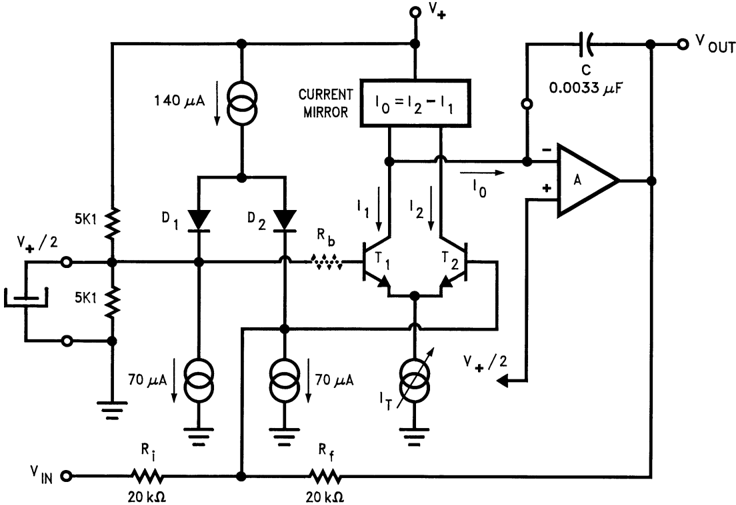

Figure 6. Variable Lowpass Filter With Distortion Correcting Diodes and Control Voltage Offset Compensation

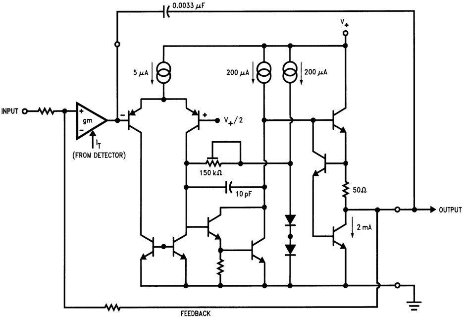

Figure 7. The OP AMP Output Stage of the LM1894

For the entire circuit, if $R_i = R_f = R$ and the diode dynamic resistance is $r_e$, you can write the transfer characteristic as:

$$\frac{V_{out}}{V_{in}} = \frac{-1}{(1 + \frac{4\pi f C K 26 \times 10^{-3}}{I_T})}$$

$$\text{where } K = (2 + \frac{R}{2 r_e}) \qquad \text{(6)}$$

Therefore, the pole frequency for $C = 0.0033 \mu F$ is:

$f_u = I_T / 4 \pi 26 \times 10^{-3} CK = I_T \times 33.2 \times 10^6$ is:

for $f_u = 1 \text{ kHz, } I_T = 33.2 \mu A$

for $f_u = 35 \text{ kHz, } I_T = 1.1 \mu A$

In operation, the transconductance stage current $I_T$ for the LM1894 will vary between the levels given above in response to the control path detected voltage. Notice that with the circuit values given in Figure 6 the maximum output voltage swing at the cut-off frequency is about ${IV}_{rms}$ (use Equation 2 and put $I_O = I_T = 33 \mu A$) and this is specified in the LM1894 data sheet as the input voltage for 3% THD. This is, of course, the condition for minimum bandwidth when noise only is normally present at the input. When signals are simultaneously present causing the audio bandwidth to increase out to 35 kHz, the transconductance stage current is over 1 mA, allowing signal swings at 1 kHz (theoretically) of over 34 Vrms. Practically, at maximum bandwidth the output swing is determined by the output stage saturation voltages that are dependent on the supply voltage (see Figure 7). With a 15 $V_{DC}$ supply, the LM1894 can handle well over 4 Vrms.

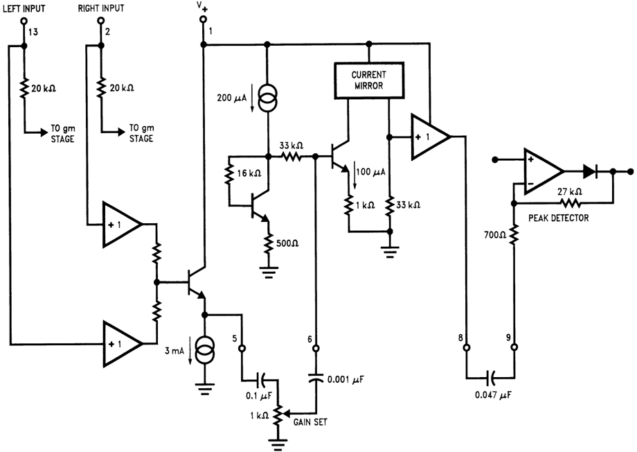

Figure 8. Control Path Amplifiers and Filters

While there are other circuit topologies that can be used to obtain a variable cut-off low pass filter, this design has certain advantages, especially when it comes to avoiding control feedthrough. Control feedthrough is the name given to voltage offsets that can occur in the audio path as the transconductance stage current changes. The audible effect is a low level 'bacon frying' noise or pops as the bandwidth changes. To prevent such voltage offsets occurring, the differential stage $T_1$ and $T_2$, the current mirrors and the diodes are arranged to provide good tracking over the entire range of the bandwidth control current $I_T$. Because the transconductance stage is driving the inverting input to an operational amplifier, a virtual ground, there will be no voltage swing at this node. This eliminates possible offset voltages from output impedance changes in the current mirror and $T_1$ collector caused by different operating currents. Last, but not least, a source of offset voltages are the base currents of $T_1$ and $T_2$. Because the transistors have a finite current gain, when the tail current $I_T$ is increased, these base currents must increase slightly. $T_1$ base current is provided by the reference voltage $(V_+ /2)$, but $T_2$ base current must come via the feedback resistor $R_f$. This current is not normally available from $D_2$ because the feedback loop is holding $T_1$ and $T_2$ base voltages equal. By adding the resistor $R_b$ in series with $T_1$ base, a compensating offset voltage is produced across the input diodes. This reduces the current in $D_1$ slightly and increases the current in $D_2$ correspondingly, allowing it to supply the increased base current requirement of $T_2$.

## 4 The Control Path

The purpose of the control path is to ensure that the audio bandwidth is always sufficiently wide to pass the desired signal, yet in the absence of this signal will decrease rapidly enough that the noise also present does not become audible. In order to do this, the control path must recognize the masking qualities of the signal source and the detector stage must be able to take advantage of the characteristics of the human ear so that audible signal distortion or un-masking does not occur.

Figure 8 shows a block diagram of the control path including the external components. A straight-forward summing amplifier combines the left and right channel inputs and acts as a buffer amplifier for the gain control. Because the noise level for signal sources can be different - cassette tapes are between -50 dB and -65 dB (depending on whether Dolby B encoding is employed) and FM broadcast noise is around -45 dB to over -75 dB (depending on signal strength) - the control path gain is adjusted such that a noise input is capable of just increasing the audio bandwidth from its minimum value. This ensures that any program material above the noise level increases the audio bandwidth so that the material is passed without distortion. Setting the potentiometer (or an equivalent pair of resistors) will be described in more detail later.

The gain control potentiometer is also part of the DNR filter characteristic derived from auditory masking considerations, see *AN-384 384 Audio Noise Reduction and Masking* (SNAA089). Combined with a 0.1 μF coupling capacitor, the total resistance of the potentiometer will cause a signal attenuation below 1.6 kHz.

$$\text{i.e. } f_1 = \frac{1}{2\pi RC} = \frac{1}{2\pi \times 10^3 \times 0.1 \times 10^{-6}} = 1.6 \text{ kHz} \qquad \text{(7)}$$

This helps to prevent signals with a high amplitude but no high frequency content above 1 kHz - such as a bass drum - from activating the control path detector and unnecessarily opening the audio bandwidth. For signals that do have a significant high frequency content (predominantly harmonics), the control path sensitivity is increased at a 12 dB/octave rate. This rapid gain in sensitivity is important since the harmonic content of program material typically falls off quickly with increasing frequency. The 12 dB/octave slope is provided by cascading two RC high pass filters composed of the coupling capacitors to the control path gain stage and detector stage and the internal input resistors to these stages. Individual corner frequencies of 5.3 kHz and 4.8 kHz respectively are used, with a combined corner frequency around 6 kHz. Above 6 kHz the gain can be allowed to decrease again since the signal energy content between 1 kHz and 6 kHz (the critical masking frequency range) will have already caused the audio bandwidth to extend beyond 30 kHz, allowing passage of any high frequency components in the audio path.

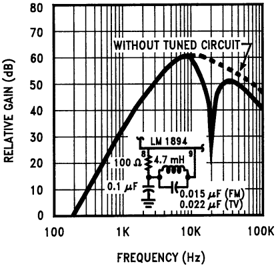

Figure 9. Control Path Frequency Response

Under some circumstances, not normal to music or speech, the source can contain relatively high level, high frequency components that are not necessarily accompanied by large levels of low frequency signal energy providing noise masking. These are spurious components such as the line scan frequency in a television receiver (15.734 kHz) or subcarrier signals such as the 19 kHz pilot tone in FM stereo broadcasting. Although both these components should be low enough to be inaudible in the audio path, their presence in the control path could cause a change in the minimum bandwidth and hence the amount of available noise reduction. Since these unwanted components are at frequencies higher than the desired control path frequency range, they are easily accommodated by including a notch filter in the control path at the specified frequency. A resonant L-C circuit with a Q of 30 will attenuate 19 kHz by over 28 dB. If a 10% tolerance 0.015 μ F capacitor is used, the coil can be a fixed 4.7 mH inductance. For 15.734 kHz a 0.022 μF capacitor is needed. When those frequency components are not present (in cassette tapes) the L-C circuit is eliminated and the gain amplifier and detector stage are coupled together with a single 0.047 μF capacitor.

Apart from providing the proper frequency response the control path gain must be enough to ensure that the detector threshold can be reached by very low noise input levels. The summing amplifier has unity gain to the sum of the left and right channel inputs and the necessary signal gain of 60 dB is split between the following gain amplifier and the detector stage. For the gain amplifier:

$$A_v = \frac{33 \times 10^3}{r_e + 10^3} = 26.2$$

$$= 28.4 \text{ dB}$$

For the detector stage, the gain to negative signal swings is:

$$A_v = \frac{27 \times 10^3}{700} = 38.6 = 31.7 \text{ dB}$$

With over 60 dB gain and typical source input noise levels, the gain potentiometer will normally be set with the wiper arm close to the ground terminal.

## 5 The Detector Stage

The last part of the LM1894 to be described is the detector stage that includes a negative peak detector and a voltage to current converter. As noted earlier, the input resistance of the detector, together with the input coupling capacitor, forms part of the control path filter. Similarly the output resistance from the detector and the gain setting feedback resistor help to determine the detector time constants. With a pulse or transient input signal, the rise time is 200 μs to 90% of the final detected voltage level. Actual rise-times will normally be longer with the detector tracking the envelope of the combined left and right channel signals after they have passed through the control path filter.

An interesting difference to compandor performance can be demonstrated with a 10 kHz tone burst. Since the LM1894 detector responds only to negative signal peaks, it will take about four input cycles to reach 90% of the final voltage on the detector capacitor (this is the 500 μs time constant called out in the data sheet). After the first two cycles the audio bandwidth will have already increased past 10 kHz and a comparison of the input and output tone bursts will show only a slight loss in amplitude in these initial cycles. A compandor, however, usually cannot afford a fast detector time constant since the rapid changes in system gain that occur when a transient signal is processed can easily cause modulation products to be developed, which may not be treated complementarily on playback, Therefore, there is a time lag before the system can change gain, which may be to the maximum signal compression (as much as 30 dB depending on the compandor type). Failure to compress immediately at the start of the tone burst means that an overshoot is present in the signal, which can be up to 30 dB higher than the final amplitude. To prevent this overshoot from causing subsequent amplifier overload (which can last for several times the period of the overshoot), clippers are required in the signal path, limiting the dynamic range of the system. Obviously, the LM1894 does not need clippers since no signal overshoots in the audio path are possible.

When the input signal transient decays, the diode in the detector stage is back biassed and the capacitor discharges primarily through the feedback resistor and takes about 60 ms to reach 90% of the final value.

$$T = RC \times 2.3 = 27 \times 10^3 \times 1 \times 10^{-6} \times 2.3 = 62.1 \text{ ms}$$

The decay time constant is required to protect the reverberatory or 'ambience' qualities of the music. For material with a limited high frequency content or a particularly poor S/N ratio, some benefit can be obtained with a faster decay time-a resistor shunted across the detector capacitor will do this. Resistors less than 27 kΩ should not be used since very fast decay times will permit the detector to start tracking the signal frequency. For signal amplitudes that are not producing the full audio bandwidth, this will cause a rapid and audible modulation of the audio bandwidth.

## 6 Bypassing the System

Sometimes it is necessary or desirable to bypass the n.r. system. This will allow a direct and instantaneous comparison of the effect that the system is having on the program material and will assist in arriving at the correct setting for the control path gain potentiometer. This facility is not practical with compandors unless unencoded passages occur in the program material. Also, should the action of the compandor become more objectionable than the noise in the original material, there is no way of switching the n.r. system off.

One way of bypassing is to simply use a double pole switch to route the signals around the LM1894. This physically ensures complete bypassing but does present a couple of problems. First, there may be a level change caused by the different impedances presented to the following audio stages when switching occurs. Second, the signal now has to be routed to the front panel where the switch is located, perhaps calling for shielded cable.

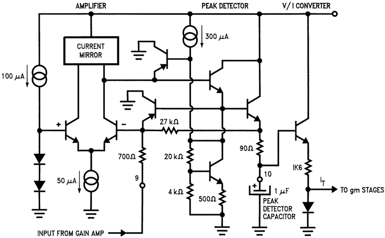

Figure 10. Peak Detector and Voltage to Current Converter

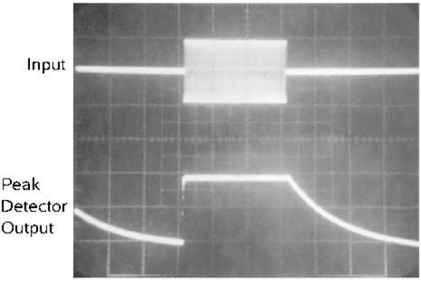

Figure 11. Peak Detector Response, 500 mV/Div

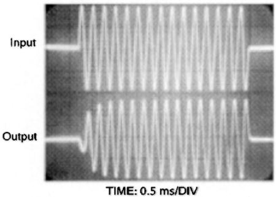

Figure 12. Audio Output Response, 10 kHz Tone Burst

A different technique that avoids these problems is to switch the LM1894 permanently into the full audio bandwidth mode. Since this provides a high S/N ratio path and low distortion the impact on the signal is minimal. Two methods can be used to switch the LM1894 audio bandwidth fully open, both with a single pole switch that is not in the audio path. Simply grounding the input of the peak detector amplifier will generate the maximum bandwidth control current and simultaneously prevent any control signals reaching the detector. Usually this is more than adequate since the maximum audio bandwidth is 34 kHz, but in some cases the 1 dB loss at 17 kHz produced by the single pole audio filters may not be desired. Figure 13 shows a way to increase the audio bandwidth to 50 kHz ( -1 dB at 25 kHz) by pulling up the detector capacitor to the reference voltage level $(V_+ /2)$ through a 1 kΩ resistor. This method is useful only for higher supply voltage applications. To increase the bandwidth significantly the detector capacitor must be pulled up to around 5V $(V_+ > 10V)$. Although a separate voltage source other than the reference pin could be used when $V_+$ is less than 10V, this can cause an internal circuit latch-up if the voltage on the detector increases faster than the reference voltage at initial turn-on.

## 7 General System Measurements and Precautions

For most applications the external components shown in Figure 13 will be required. In fact, the only recommended deviation from these values is the substitution of an equivalent pair of fixed resistors for the gain setting potentiometer. Location of the LM1894 in the audio path is important and should be prior to any tone or volume controls. In tape systems, right after the playback head pre-amplifier is the best place, or at the stereo decoder output (after de-emphasis and the multiplex filter) in an FM broadcast receiver. The LM1894 is designed for a nominal input level of 300 mVrms. Sources with a much lower pre-amplifier output level either requires an additional gain block or substitutions of the LM832, which is designed for 30 mVrms input levels.

The same circuit as Figure 13 can be used for measurements on the I/C performance but, as with any other n.r. system, care in intepretation of the results may be necessary. For example, while the decay time constant for a tone burst signal is pretty constant, the attack time will depend on the tone frequency.

Sometimes separation of the audio path input and the control path is required, particularly when the frequency response or the THD with low input signal levels is being measured. If the audio and control paths are not separated then a typical audio system measurement of the frequency response will not appear as expected. This is because the control path frequency response is non-linear, exhibiting low sensitivity at low frequencies. When a low level input signal is swept through the audio frequency range, at low frequencies the audio -3 dB bandwidth will be held at 1 kHz, and the audio path signal will fall in amplitude as the signal goes above 1 kHz. As the signal frequency gets yet higher, the increasing sensitivity of the control path will allow the detector to be activated and the audio path -3 dB frequency starts to overtake the signal frequency. This causes the output signal amplitude to increase again giving the appearance that there is a dip in the audio frequency response around 1-2 kHz. It is worth remembering at this point that the audio path frequency response is always flat below some corner frequency and rolls off at 6 dB/octave above this frequency. In normal operation this corner frequency is the result of the aggregrate control path signals in the 1 kHz to 6 kHz region and not the result of a single input frequency. To properly measure the frequency response of the audio path at a particular signal input frequency and amplitude, the control path input is separated by disconnecting $C_5$ from Pin 5 and injecting the signal through $C_5$ only. Then, a separate swept frequency response measurement can be made in the audio path. Similarly measurements of THD should include separation of the audio and control path inputs.

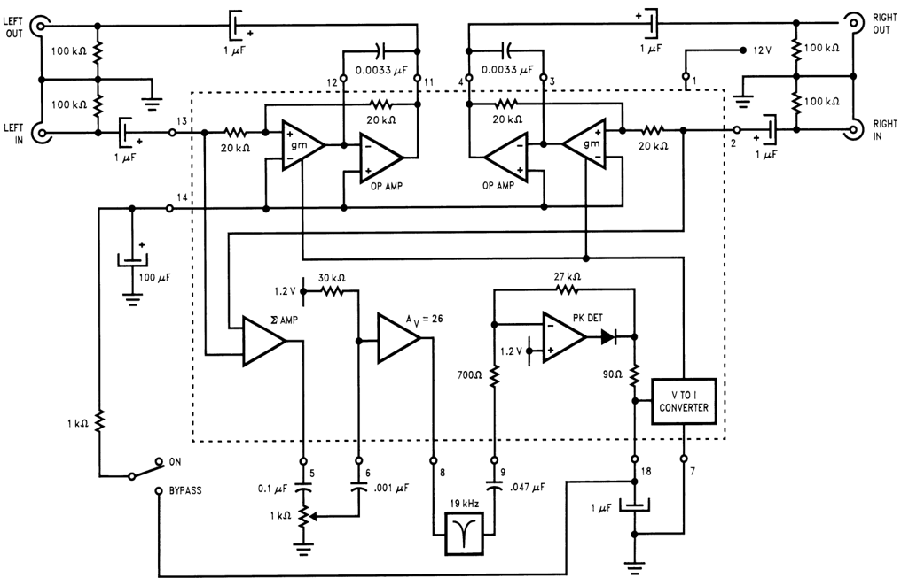

Figure 13. Complete Stereo Noise Reduction System

## 8 Pitfalls - Or What to Listen For

Many people are understandably wary of non-complementary n.r. systems since there is no perfect means for distinguishing between the desired signal and noise. A thorough understanding of the psycho-acoustic basis for noise masking will go a long way to allaying these fears, but a much simpler method is to listen to a variety of source material with a DNR system being switched in and out. Even so, improper implementation of the LM1894-wrong location in the audio path changing either the level or frequency response of the source-or incorrect external component values, or the wrong sensitivity setting, can all strongly affect the audio in an undesired way. Sometimes, unhappily, the source is really beyond repair and some compromise must be made. Phonograph discs with bad scratches may require special treatment (a click and pop remover) and some older tape recordings may show some or all of the following problems.

- Pumping
  - Incorrect selection of the control path bandwidth external components can result in an audible increase in noise as the input level changes. This is most likely to be heard on solo instruments or on speech. Sometimes the S/N rate is too poor and masking will not be completely effective, (when the bandwidth is wide enough to pass the program material, the increase in noise is audible). Cutting down on the pumping also affects the program material to some extent and judgement as to which is preferable is required. Sometimes a shorter decay time constant in the detector circuit will help, especially for a source that always shows these characteristics, but for better program material a return to the recommended detector characteristics is imperative.

- High Frequency Loss
  - This can be caused by an improper control path gain setting, perhaps deliberate because of the source S/N ratio as described above or incorrect values for the audio path filter capacitors. Capacitors larger than the recommended values will scale the operating bandwidth lower, causing lower -3 dB corner frequencies for a given control path signal. Return to the correct capacitor values and the appropriate control path gain setting will always ensure that the h.f. content of the signal source is preserved.
- Apparent High Frequency Loss
  - The ability to instantaneously A/B the source with and without noise reduction can sometimes exhibit an apparent loss of h.f. signal content as the DNR system operates. This is most likely to happen with sources having an S/N ratio of less than 45 dB and is a subjective effect in that the program material probably does not have any significant h.f. components. It has been reported several times elsewhere that adding high frequency noise (hiss) to a music signal with a limited frequency range will seem to add to the h.f. content of the music. Trying sources with a higher S/N ratio that do not demonstrate this effect can re-assure the listener that the DNR system is operating properly. Alternatively a control path sensitivity can be used that leaves the audio bandwidth slightly wider, preserving the 'h.f. content' at the expense of less noise reduction in the absence of music.
- Sensitivity Setting
  - Since this is the only adjustment in the system, it is the one most likely to cause problems. Improper settings can cause any of the previously described problems. Factory pre-sets can (and are) used, but only when the source is well defined with known noise level. For the user who intends to noise reduce a variety of sources, the control path gain potentiometer is required and should be adjusted for each application. A bypass switch is helpful in this respect since it allows rapid A/B comparison. Another useful aid is a bandwidth indicator, shown in Figure 14. This is simply an LED display driver, the LM3915, operating from the voltage on the detector filter capacitor at Pin 10 of the LM1894. The LM3915 will light successive LEDs for each 3 dB increase in voltage. The resistor values are chosen such that the capacitor voltage when the LM1894 is at minimum audio bandwidth, is just able to light the first LED, and a full audio bandwidth control signal will light the upper LED. Experience will show that adjusting the sensitivity so that the noise in the source (no signal is present) is just able to light the second LED, will produce good results. This display also provides constant reassurance that the system audio bandwidth really is adequate to process the music. A simpler detector, using a dual comparator and a couple of LEDs can be constructed instead, with threshold levels selected to show the correct sensitivity setting, minimum bandwidth, maximum bandwidth or some intermediate bandwidth as desired.

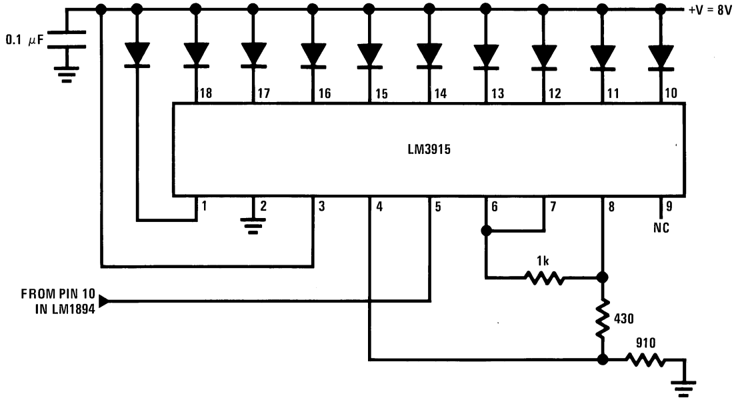

Figure 14. Bar Graph Display of Peak Detector Voltage

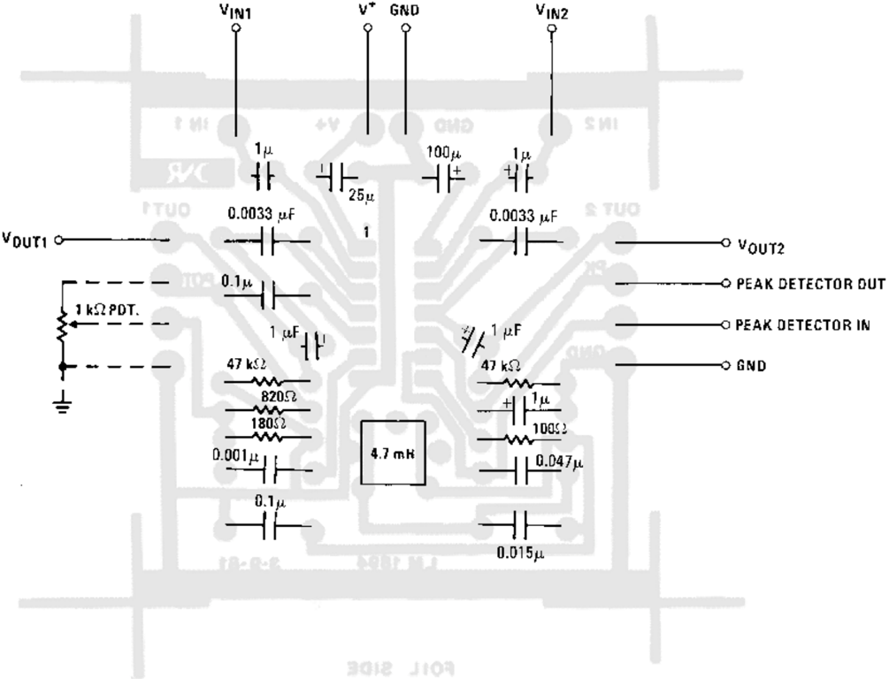

Figure 15. DNR Component Diagram Printed Circuit Layout

## 9 References

- 'Intuitive I/C Op Amps' by T. M. Fredericksen, pp. 24-26
- AN-384 384 Audio Noise Reduction and Masking (SNAA089)

## IMPORTANT NOTICE

Texas Instruments Incorporated and its subsidiaries (TI) reserve the right to make corrections, enhancements, improvements and other changes to its semiconductor products and services per JESD46, latest issue, and to discontinue any product or service per JESD48, latest issue. Buyers should obtain the latest relevant information before placing orders and should verify that such information is current and complete. All semiconductor products (also referred to herein as 'components') are sold subject to TI's terms and conditions of sale supplied at the time of order acknowledgment.

TI warrants performance of its components to the specifications applicable at the time of sale, in accordance with the warranty in TI's terms and conditions of sale of semiconductor products. Testing and other quality control techniques are used to the extent TI deems necessary to support this warranty. Except where mandated by applicable law, testing of all parameters of each component is not necessarily performed.

TI assumes no liability for applications assistance or the design of Buyers' products. Buyers are responsible for their products and applications using TI components. To minimize the risks associated with Buyers' products and applications, Buyers should provide adequate design and operating safeguards.

TI does not warrant or represent that any license, either express or implied, is granted under any patent right, copyright, mask work right, or other intellectual property right relating to any combination, machine, or process in which TI components or services are used. Information published by TI regarding third-party products or services does not constitute a license to use such products or services or a warranty or endorsement thereof. Use of such information may require a license from a third party under the patents or other intellectual property of the third party, or a license from TI under the patents or other intellectual property of TI.

Reproduction of significant portions of TI information in TI data books or data sheets is permissible only if reproduction is without alteration and is accompanied by all associated warranties, conditions, limitations, and notices. TI is not responsible or liable for such altered documentation. Information of third parties may be subject to additional restrictions.

Resale of TI components or services with statements different from or beyond the parameters stated by TI for that component or service voids all express and any implied warranties for the associated TI component or service and is an unfair and deceptive business practice. TI is not responsible or liable for any such statements.

Buyer acknowledges and agrees that it is solely responsible for compliance with all legal, regulatory and safety-related requirements concerning its products, and any use of TI components in its applications, notwithstanding any applications-related information or support that may be provided by TI. Buyer represents and agrees that it has all the necessary expertise to create and implement safeguards which anticipate dangerous consequences of failures, monitor failures and their consequences, lessen the likelihood of failures that might cause harm and take appropriate remedial actions. Buyer will fully indemnify TI and its representatives against any damages arising out of the use of any TI components in safety-critical applications.

In some cases, TI components may be promoted specifically to facilitate safety-related applications. With such components, TI's goal is to help enable customers to design and create their own end-product solutions that meet applicable functional safety standards and requirements. Nonetheless, such components are subject to these terms.

No TI components are authorized for use in FDA Class III (or similar life-critical medical equipment) unless authorized officers of the parties have executed a special agreement specifically governing such use.

Only those TI components which TI has specifically designated as military grade or 'enhanced plastic' are designed and intended for use in military/aerospace applications or environments. Buyer acknowledges and agrees that any military or aerospace use of TI components which have not been so designated is solely at the Buyer's risk, and that Buyer is solely responsible for compliance with all legal and regulatory requirements in connection with such use.

TI has specifically designated certain components as meeting ISO/TS16949 requirements, mainly for automotive use. In any case of use of non-designated products, TI will not be responsible for any failure to meet ISO/TS16949.

## Products

## Applications

|   |   |   |    |
|------------------------------|---------------------------------|---------------------------------|-----------------------------------|
| Audio                        | [www.ti.com/audio](https://www.ti.com/audio)                | Automotive and Transportation   | [www.ti.com/automotive](https://www.ti.com/automotive)             |
| Amplifiers                   | [amplifier.ti.com](https://amplifier.ti.com)                | Communications and Telecom      | [www.ti.com/communications](https://www.ti.com/communications)         |
| Data Converters              | [dataconverter.ti.com](https://dataconverter.ti.com)            | Computers and Peripherals       | [www.ti.com/computers](https://www.ti.com/computers)              |
| DLP® Products                | [www.dlp.com](https://www.dlp.com)                     | Consumer Electronics            | [www.ti.com/consumer-apps](https://www.ti.com/consumer-apps)          |
| DSP                          | [dsp.ti.com](https://dsp.ti.com)                      | Energy and Lighting             | [www.ti.com/energy](https://www.ti.com/energy)                 |
| Clocks and Timers            | [www.ti.com/clocks](https://www.ti.com/clocks)               | Industrial                      | [www.ti.com/industrial](https://www.ti.com/industrial)             |
| Interface                    | [interface.ti.com](https://interface.ti.com)                | Medical                         | [www.ti.com/medical](https://www.ti.com/medical)                |
| Logic                        | [logic.ti.com](https://logic.ti.com)                    | Security                        | [www.ti.com/security](https://www.ti.com/security)               |
| Power Mgmt                   | [power.ti.com](https://power.ti.com)                    | Space, Avionics and Defense     | [www.ti.com/space-avionics-defense](https://www.ti.com/space-avionics-defense) |
| Microcontrollers             | [microcontroller.ti.com](https://microcontroller.ti.com)          | Video and Imaging               | [www.ti.com/video](https://www.ti.com/video)                  |
| RFID                         | [www.ti-rfid.com](https://www.ti-rfid.com)                 |                                 |                                   |
| OMAP Applications Processors | [www.ti.com/omap](https://www.ti.com/omap)                 | TI E2E Community                | [e2e.ti.com](https://e2e.ti.com)                        |
| Wireless Connectivity        | [www.ti.com/wirelessconnectivity](https://www.ti.com/wirelessconnectivity) |   |                                   |

Mailing Address: Texas Instruments, Post Office Box 655303, Dallas, Texas 75265 Copyright © 2013, Texas Instruments Incorporated