www.ti.com

## LM1894 Dynamic Noise Reduction System DNR

Check for Samples: LM1894

## FEATURES

- 2 · Non-Complementary Noise Reduction, 'Single Ended'
- Low Cost External Components, No Critical Matching
- Compatible with All Prerecorded Tapes and FM
- 10 dB Effective Tape Noise Reduction CCIR/ARM Weighted
- Wide Supply Range, 4.5V to 18V
- 1 Vrms Input Overload

## DESCRIPTION

The LM1894 is a stereo noise reduction circuit for use with audio playback systems. The DNR system is non-complementary, meaning it does not require encoded source material. The system is compatible with virtually all prerecorded tapes and FM broadcasts. Psychoacoustic masking, and an adaptive bandwidth scheme allow the DNR to achieve 10 dB of noise reduction. DNR can save circuit board space and cost because of the few additional components required.

## APPLICATIONS

- Automotive Radio/Tape Players
- Compact Portable Tape Players
- Quality HI-FI Tape Systems
- VCR Playback Noise Reduction
- Video Disc Playback Noise Reduction

## Typical Application

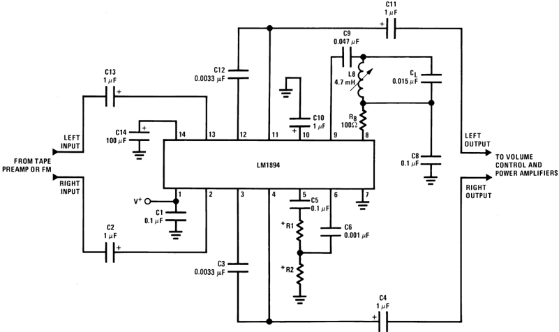

*R1 + R2 = 1 k Ω total.

See Application Hints.

Figure 1. Component Hook-Up for Stereo DNR System 14-Pin SOIC or PDIP or TSSOP See D or NFF0014A or PW Package

## Absolute Maximum Ratings (1)(2)

|            |             |             |              |
|---------------------------|---------------------------|---------------------------|------------------|
| Supply Voltage            |             |             | 20V              |
| Input Voltage Range, V pk |  |  | V S /2           |
| Operating Temperature (3) |  |  | 0°C to +70°C     |
| Storage Temperature       |        |        | - 65°C to +150°C |
| Soldering Information        | PDIP Package              | Soldering (10 seconds)    | 260°C            |
| Soldering Information        | SOIC Package              | Vapor Phase (60 seconds)  | 215°C            |
| Soldering Information        | SOIC Package              | Infrared (15 seconds)     | 220°C            |

- (1) 'Absolute Maximum Ratings' indicate limits beyond which damage to the device may occur. Operating Ratings indicate conditions for which the device is functional, but do not ensure specific performance limits.
- (2) If Military/Aerospace specified devices are required, please contact the Texas Instruments Sales Office/Distributors for availability and specifications.
- (3) For operation in ambient temperature above 25°C, the device must be derated based on a 150°C maximum junction temperature and a thermal resistance of:
  - (a) 80°C/W junction to ambient for the PDIP package,
  - (b) 105°C/W junction to ambient for the SOIC package, and
  - (c) 150°C/W junction to ambient for the TSSOP package.

## Electrical Characteristics

VS = 8V, TA = 25°C, VIN = 300 mV at 1 kHz, circuit shown in Figure 1 unless otherwise specified

| Parameter                 | Conditions                                                                                                                                            | Min   | Typ         | Max   | Units       |
|---------------------------|-------------------------------------------------------------------------------------------------------------------------------------------------------|-------|-------------|-------|-------------|
| Operating Supply Range    |                                                                                                                                                       | 4.5   | 8           | 18    | V           |
| Supply Current            | V S = 8V                                                                                                                                              |       | 17          | 30    | mA          |
| MAIN SIGNAL PATH          |                                                                                                                                                       |       |             |       |             |
| Voltage Gain              | DC Ground Pin 9 (1)                                                                                                                                   | - 0.9 | - 1         | - 1.1 | V/V         |
| DC Output Voltage         |                                                                                                                                                       | 3.7   | 4.0         | 4.3   | V           |
| Channel Balance           | DC Ground Pin 9                                                                                                                                       | - 1.0 |             | 1.0   | dB          |
| Minimum Balance           | AC Ground Pin 9 with 0.1 μ FCapacitor (1)                                                                                                             | 675   | 965         | 1400  | Hz          |
| Maximum Bandwidth         | DC Ground Pin 9 (1)                                                                                                                                   | 27    | 34          | 46    | kHz         |
| Effective Noise Reduction | CCIR/ARM Weighted (2)                                                                                                                                 |       | - 10        | - 14  | dB          |
| Total Harmonic Distortion | DC Ground Pin 9                                                                                                                                       |       | 0.05        | 0.1   | %           |
| Input Headroom            | Maximum V IN for 3% THD AC Ground Pin 9                                                                                                               |       | 1.0         |       | Vrms        |
| Output Headroom           | Maximum V OUT for 3% THD DC Ground Pin 9                                                                                                              |       | V S - 1.5   |       | Vp-p        |
| Signal to Noise           | BW = 20 Hz-20 kHz, re 300 mV   AC Ground Pin 9   DC Ground Pin 9   CCIR/ARM Weighted re 300 mV (3)   AC Ground Pin 9   DC Ground Pin 9   CCIR Peak, re 300 mV (4)   AC Ground Pin 9   DC Ground Pin 9 |         82   70          |    79   77     88   76      77   64 |       |     dB   dB     dB   dB      dB   dB |
| Input Impedance           | Pin 2 and Pin 13                                                                                                                                      | 14    | 20          | 26    |   k Ω          |
| Channel Separation        | DC Ground Pin 9                                                                                                                                       | - 50  | - 70        |       | dB          |
| Power Supply Rejection    | C14 = 100 μ F, V RIPPLE = 500 mVrms, f = 1 kHz                                                                                                        | - 40  | - 56        |       | dB          |
| Output DC Shift           | Reference DVM to Pin 14 and Measuree Output DC Shift from Minimum to Maximum Band-width (5)                                                           |       | 4.0         | 20    | mV          |

- (1) To force the DNR system into maximum bandwidth, DC ground the input to the peak detector, pin 9. A negative temperature coefficient
of −0.5%/°C on the bandwidth, reduces the maximum bandwidth at increased ambient temperature or higher package dissipation. AC
ground pin 9 or pin 6 to select minimum bandwidth. To change minimum and maximum bandwidth, see Application Hints.
- (2) The maximum noise reduction CCIR/ARM weighted is about 14 dB. This is accomplished by changing the bandwidth from maximum to
minimum. In actual operation, minimum bandwidth is not selected, a nominal minimum bandwidth of about 2 kHz gives −10 dB of noise
reduction. See Application Hints.
- (3) The CCIR/ARM weighted noise is measured with a 40 dB gain amplifier between the DNR system and the CCIR weighting filter; it is
then input referred.
- (4) Measured using the Rhode-Schwartz psophometer.
- (5) Pin 10 is DC forced half way between the maximum bandwidth DC level and min

## Electrical Characteristics (continued)

VS = 8V, TA = 25°C, VIN = 300 mV at 1 kHz, circuit shown in Figure 1 unless otherwise specified

| Parameter                      | Conditions                                            |   Min |   Typ |   Max | Units   |
|--------------------------------|-------------------------------------------------------|-------|-------|-------|---------|
| CONTROL SIGNAL PATH            |                                                       |       |       |       |         |
| Summing Amplifier Voltage Gain | Both Channels Driven                                  |   0.9 |     1 |   1.1 | V/V     |
| Gain Amplifier Input Impedance | Pin 6                                                 |    24 |    30 |    39 | k Ω     |
| Voltage Gain                   | Pin 6 to Pin 8                                        |  21.5 |    24 |  26.5 | V/V     |
| Peak Detector Input Impedance  | Pin 9                                                 |   560 |   700 |   840 | Ω       |
| Voltage Gain                   | Pin 9 to Pin 10                                       |    30 |    33 |    36 | V/V     |
| Attack Time                    | Measured to 90% of Final Value with 10 kHz Tone Burst |   300 |   500 |   700 | μ s     |
| Decay Time                     | Measured to 90% of Final Value with 10 kHz Tone Burst |    45 |    60 |    75 | ms      |
| DC Voltage Range               | Minimum Bandwidth to Maximum Bandwidth                |   1.1 |       |   3.8 | V       |

## Typical Performance Characteristics

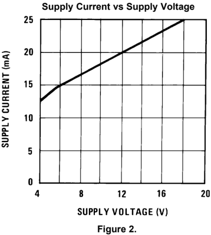

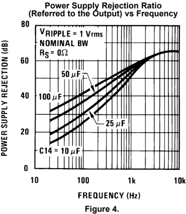

## Channel Separation (Referred to the Output) vs Frequency

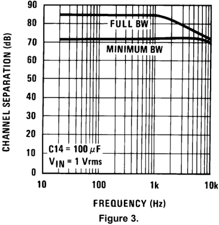

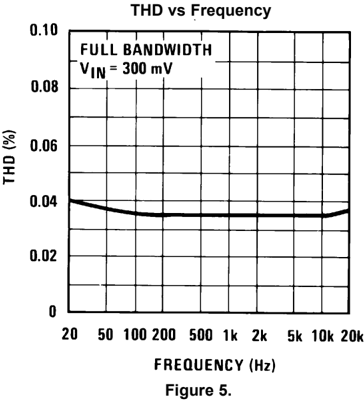

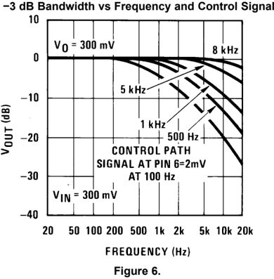

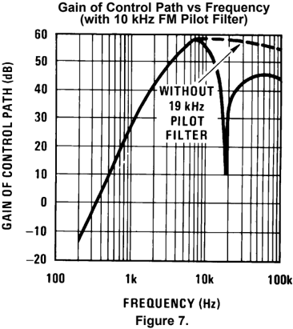

## Typical Performance Characteristics (continued)

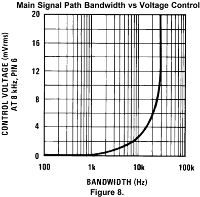

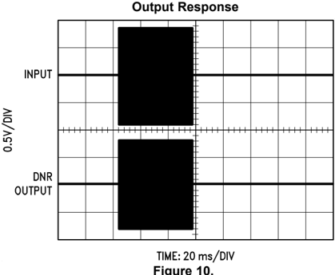

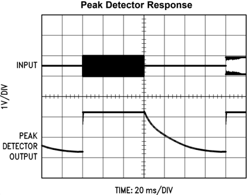

## (Figure 1)

| Component   | Value             | Purpose                                                                                                                                                                                             |
|-------------|-------------------|-----------------------------------------------------------------------------------------------------------------------------------------------------------------------------------------------------|
| C1          | 0.1 μ F-100 μ F   | May be part of power supply, or may be added to suppress power supply oscillation.                                                                                                                  |
| C2, C13     | 1 μ F             | Blocks DC, pin 2 and pin 13 are at DC potential of V S /2. C2, C13 form a low frequency pole with 20k R IN .                                                                                        |
| C14         | 25 μ F-100 μ F    | Improves power supply rejection.                                                                                                                                                                    |
| C3, C12     | 0.0033 μ F        | Forms integrator with internal gm block and op amp. Sets bandwidth conversion gain of 33 Hz/ μ A of gm current.                                                                                     |
| C4, C11     | 1 μ F             | Output coupling capacitor. Output is at DC potential of V S /2.                                                                                                                                     |
| C5          | 0.1 μ F           | Works with R1 and R2 to attenuate low frequency transients which could disturb control path operation.                                                                                              |
| C6          | 0.001 μ F         | Works with input resistance of pin 6 to form part of control path frequency weighting.                                                                                                              |
| C8          | 0.1 μ F           | Combined with L8 and C L forms 19 kHz filter for FM pilot. This is only required in FM applications (1) .                                                                                           |
| L8, C L     | 4.7 mH, 0.015 μ F | Forms 19 kHz filter for FM pilot. L8 is Toko coil CAN-1A185HM (1)(2) .                                                                                                                              |
| C9          | 0.047 μ F         | Works with input resistance of pin 9 to form part of control path frequency weighting.                                                                                                              |
| C10         | 1 μ F             | Set attack and decay time of peak detector.                                                                                                                                                         |
| R1, R2      | 1 k Ω             | Sensitivity resistors set the noise threshold. Reducing attenuation causes larger signals to be peak detected and larger bandwidth in main signal path. Total value of R1 + R2 should equal 1 k Ω . |
| R8          | 100 Ω             | Forms RC roll-off with C8. This is only required in FM applications.                                                                                                                                |

- (1) When FM applications are not required, pin 8 and pin 9 hook-up as follows:

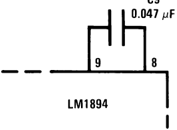
- (2) Toko America Inc., 1250 Feehanville Drive, Mt. Prospect IL 60056

## Circuit Operation

The LM1894 has two signal paths, a main signal path and a bandwidth control path. The main path is an audio low pass filter comprised of a gm block with a variable current, and an op amp configured as an integrator. As seen in Figure 11, DC feedback constrains the low frequency gain to AV = -1. Above the cutoff frequency of the filter, the output decreases at -6 dB/oct due to the action of the 0.0033 μ F capacitor.

The purpose of the control paths is to generate a bandwidth control signal which replicates the ear's sensitivity to noise in the presence of a tone. A single control path is used for both channels to keep the stereo image from wandering. This is done by adding the right and left channels together in the summing amplifier of Figure 11. The R1, R2 resistor divider adjusts the incoming noise level to open slightly the bandwidth of the low pass filter. Control path gain is about 60 dB and is set by the gain amplifier and peak detector gain. This large gain is needed to ensure the low pass filter bandwidth can be opened by very low noise floors. The capacitors between the summing amplifier output and the peak detector input determine the frequency weighting as shown in the Typical Performance Characteristics. The 1 μ F capacitor at pin 10, in conjunction with internal resistors, sets the attack and decay times. The voltage is converted into a proportional current which is fed into the gm blocks. The bandwidth sensitivity to gm current is 33 Hz/ μ A. In FM stereo applications at 19 kHz pilot filter is inserted between pin 8 and pin 9 as shown in Figure 1.

Figure 12 is an interesting curve and deserves some discussion. Although the output of the DNR system is a linear function of input signal, the -3 dB bandwidth is not. This is due to the non-linear nature of the control path. The DNR system has a uniform frequency response, but looking at the -3 dB bandwidth on a steady state basis with a single frequency input can be misleading. It must be remembered that a single input frequency can only give a single -3 dB bandwidth and the roll-off from this point must be a smooth -6 dB/oct.

A more accurate evaluation of the frequency response can be seen in Figure 13. In this case the main signal path is frequency swept, while the control path has a constant frequency applied. It can be seen that different control path frequencies each give a distinctive gain roll-off.

## PSYCHOACOUSTIC BASICS

The dynamic noise reduction system is a low pass filter that has a variable bandwidth of 1 kHz to 30 kHz, dependent on music spectrum. The DNR system operates on three principles of psychoacoustics.

1. White noise can mask pure tones. The total noise energy required to mask a pure tone must equal the energy of the tone itself. Within certain limits, the wider the band of masking noise about the tone, the lower the noise amplitude need be. As long as the total energy of the noise is equal to or greater than the energy of the tone, the tone will be inaudible. This principle may be turned around; when music is present, it is capable of masking noise in the same bandwidth.
2. The ear cannot detect distortion for less than 1 ms. On a transient basis, if distortion occurs in less than 1 ms, the ear acts as an integrator and is unable to detect it. Because of this, signals of sufficient energy to mask noise open bandwidth to 90% of the maximum value in less than 1 ms. Reducing the bandwidth to within 10% of its minimum value is done in about 60 ms: long enough to allow the ambience of the music to pass through, but not so long as to allow the noise floor to become audible.
3. Reducing the audio bandwidth reduces the audibility of noise. Audibility of noise is dependent on noise spectrum, or how the noise energy is distributed with frequency. Depending on the tape and the recorder equalization, tape noise spectrum may be slightly rolled off with frequency on a per octave basis. The ear sensitivity on the other hand greatly increases between 2 kHz and 10 kHz. Noise in this region is extremely audible. The DNR system low pass filters this noise. Low frequency music will not appreciably open the DNR bandwidth, thus 2 kHz to 20 kHz noise is not heard.

## Block Diagram

Figure 11.

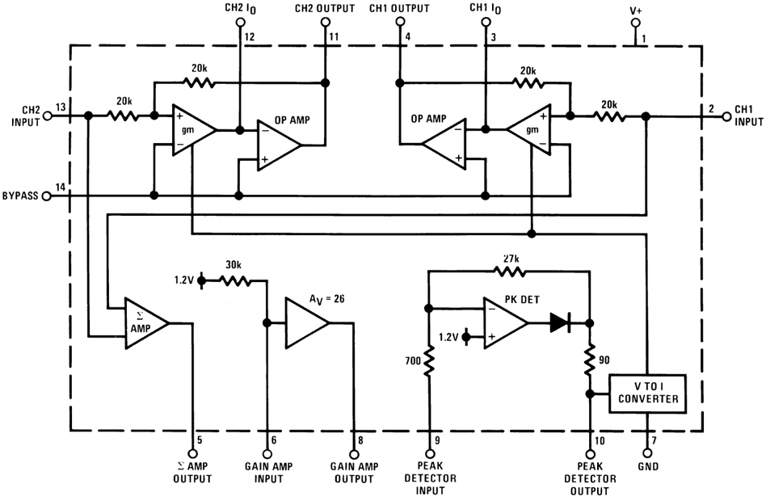

Figure 12. Output vs Frequency

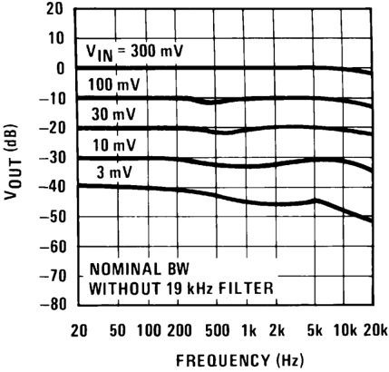

Figure 13. -3 dB Bandwidth vs Frequency and Control Signal

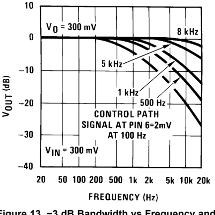

## APPLICATION HINTS

The DNR system should always be placed before tone and volume controls as shown in Figure 1. This is because any adjustment of these controls would alter the noise floor seen by the DNR control path. The sensitivity resistors R1 and R2 may need to be switched with the input selector, depending on the noise floors of different sources, i.e., tape, FM, phono. To determine the value of R1 and R2 in a tape system for instance; apply tape noise (no program material) and adjust the ratio of R1 and R2 to open slightly the bandwidth of the main signal path. This can easily be done by viewing the capacitor voltage of pin 10 with an oscilloscope, or by using the circuit of Figure 14. This circuit gives an LED display of the voltage on the peak detector capacitor. Adjust the values of R1 and R2 (their sum is always 1 k Ω ) to light the LEDs of pin 1 and pin 18. The LED bar graph does not indicate signal level, but rather instantaneous bandwidth of the two filters; it should not be used as a signal-level indicator. For greater flexibility in setting the bandwidth sensitivity, R1 and R2 could be replaced by a 1 k Ω potentiometer.

To change the minimum and maximum value of bandwidth, the integrating capacitors, C3 and C12, can be scaled up or down. Since the bandwidth is inversely proportional to the capacitance, changing this 0.0039 μ F capacitor to 0.0033 μ F will change the typical bandwidth from 965 Hz-34 kHz to 1.1 kHz-40 kHz. With C3 and C12 set at 0.0033 μ F, the maximum bandwidth is typically 34 kHz. A double pole double throw switch can be used to completely bypass DNR.

The capacitor on pin 10 in conjunction with internal resistors sets the attack and decay times. The attack time can be altered by changing the size of C10. Decay times can be decreased by paralleling a resistor with C10, and increased by increasing the value of C10.

When measuring the amount of noise reduction of the DNR system, the frequency response of the cassette should be flat to 10 kHz. The CCIR weighting network has substantial gain to 8 kHz and any additional roll-off in the cassette player will reduce the benefits of DNR noise reduction. A typical signal-to-noise measurement circuit is shown in Figure 15. The DNR system should be switched from maximum bandwidth to nominal bandwidth with tape noise as a signal source. The reduction in measured noise is the signal-to-noise ratio improvement.

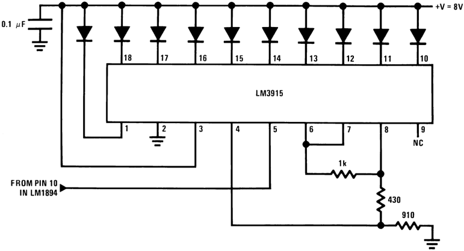

Figure 14. Bar Graph Display of Peak Detector Voltage

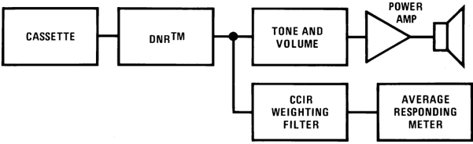

Figure 15. Technique for Measuring S/N Improvement of the DNR System

## FOR FURTHER READING

## Tape Noise Levels

1. 'A Wide Range Dynamic Noise Reduction System', Blackmer, 'dB' Magazine, August-September 1972, Volume 6, #8.
2. 'Dolby B-Type Noise Reduction System', Berkowitz and Gundry, Sert Journal, May-June 1974, Volume 8.
3. 'Cassette vs Elcaset vs Open Reel', Toole, Audioscene Canada, April 1978.
4. 'CCIR/ARM: A Practical Noise Measurement Method', Dolby, Robinson, Gundry, JAES, 1978.

## Noise Masking

1. 'Masking and Discrimination', Bos and De Boer, JAES, Volume 39, #4, 1966.
2. 'The Masking of Pure Tones and Speech by White Noise', Hawkins and Stevens, JAES, Volume 22, #1, 1950.
3. 'Sound System Engineering', Davis Howard W. Sams and Co.
4. 'High Quality Sound Reproduction', Moir, Chapman Hall, 1960.
5. 'Speech and Hearing in Communication', Fletcher, Van Nostrand, 1953.

## Printed Circuit Layout

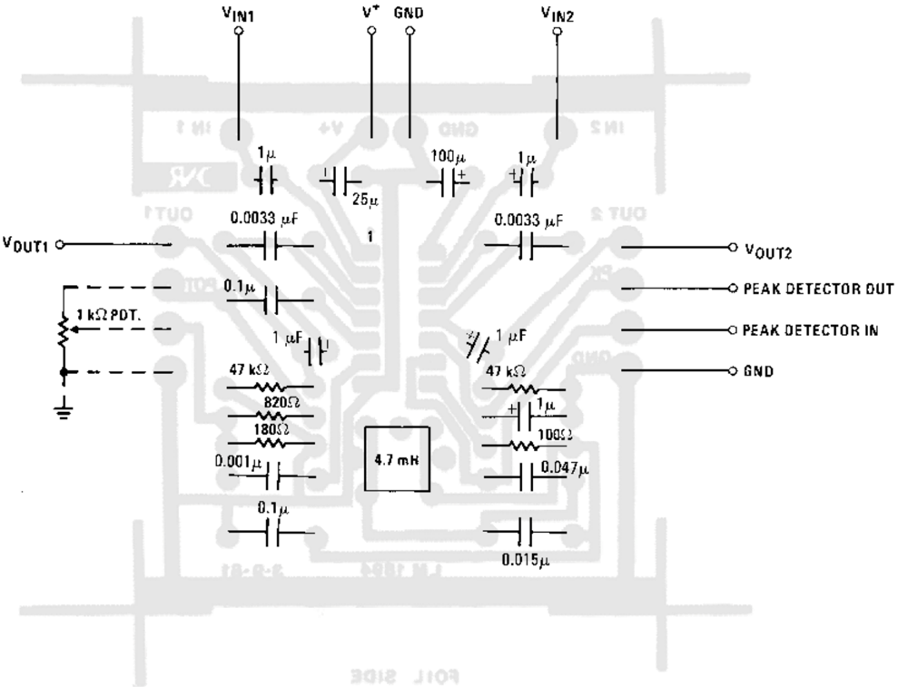

Figure 16. DNR Component Diagram

## REVISION HISTORY

Changes from Revision B (April 2013) to Revision C

Changed layout of National Data Sheet to TI format .......................................................................................................... 11

## PACKAGING INFORMATION

| Orderable part number   | Status (1)   | Material type (2)   | Package &#124; Pins   | Package qty &#124; Carrier   | RoHS (3)   | Lead finish/ Ball material (4)   | MSL rating/ Peak reflow (5)   | Op temp (°C)   | Part marking (6)   |
|-------------------------|--------------|---------------------|-----------------------|------------------------------|------------|----------------------------------|-------------------------------|----------------|--------------------|
| LM1894MX/NOPB           | Active       | Production          | SOIC (D) &#124; 14    | 2500 &#124; LARGE T&R        | Yes        | SN                               | Level-1-260C-UNLIM            | 0 to 70        | LM1894M            |
| LM1894MX/NOPB.B         | Active       | Production          | SOIC (D) &#124; 14    | 2500 &#124; LARGE T&R        | Yes        | SN                               | Level-1-260C-UNLIM            | 0 to 70        | LM1894M            |

- (1) Status:  For more details on status, see our product life cycle
- (2) Material type: When designated, preproduction parts are prototypes/experimental devices, and are not yet approved or released for full production. Testing and final process, including without limitation quality assurance, reliability performance testing, and/or process qualification, may not yet be complete, and this item is subject to further changes or possible discontinuation. If available for ordering, purchases will be subject to an additional waiver at checkout, and are intended for early internal evaluation purposes only. These items are sold without warranties of any kind.
- (3) RoHS values: Yes, No, RoHS Exempt. See the TI RoHS Statement for additional information and value definition.
- (4) Lead finish/Ball material: Parts may have multiple material finish options. Finish options are separated by a vertical ruled line. Lead finish/Ball material values may wrap to two lines if the finish value exceeds the maximum column width.
- (5) MSL rating/Peak reflow: The moisture sensitivity level ratings and peak solder (reflow) temperatures. In the event that a part has multiple moisture sensitivity ratings, only the lowest level per JEDEC standards is shown. Refer to the shipping label for the actual reflow temperature that will be used to mount the part to the printed circuit board.
- (6) Part marking: There may be an additional marking, which relates to the logo, the lot trace code information, or the environmental category of the part.

Multiple part markings will be inside parentheses. Only one part marking contained in parentheses and separated by a "~" will appear on a part. If a line is indented then it is a continuation of the previous line and the two combined represent the entire part marking for that device.

Important Information and Disclaimer: The information provided on this page represents TI's knowledge and belief as of the date that it is provided. TI bases its knowledge and belief on information provided by third parties, and makes no representation or warranty as to the accuracy of such information. Efforts are underway to better integrate information from third parties. TI has taken and continues to take reasonable steps to provide representative and accurate information but may not have conducted destructive testing or chemical analysis on incoming materials and chemicals. TI and TI suppliers consider certain information to be proprietary, and thus CAS numbers and other limited information may not be available for release.

In no event shall TI's liability arising out of such information exceed the total purchase price of the TI part(s) at issue in this document sold by TI to Customer on an annual basis.

## TAPE AND REEL INFORMATION

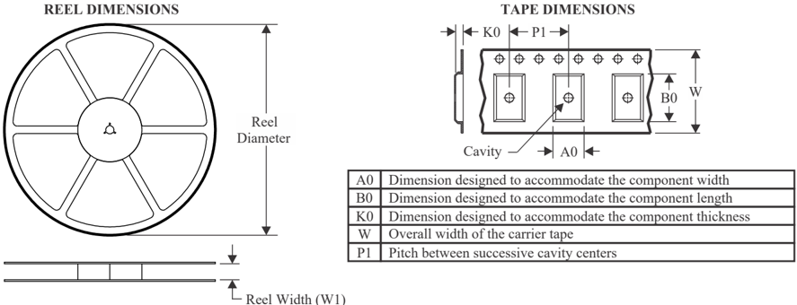

## QUADRANT ASSIGNMENTS FOR PIN 1 ORIENTATION IN TAPE

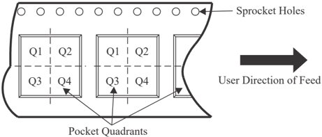

*All dimensions are nominal
| Device        | Package Type   | Package Drawing   |   Pins |   SPQ |   Reel Diameter (mm) |   Reel Width W1 (mm) |   A0 (mm) |   B0 (mm) |   K0 (mm) |   P1 (mm) |   W (mm) | Pin1 Quadrant   |
|---------------|----------------|-------------------|--------|-------|----------------------|----------------------|-----------|-----------|-----------|-----------|----------|-----------------|
| LM1894MX/NOPB | SOIC           | D                 |     14 |  2500 |                330.0 |                 16.4 |       6.5 |      9.35 |       2.3 |       8.0 |     16.0 | Q1              |

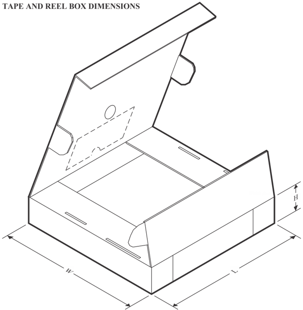

SCALE  1.80

*All dimensions are nominal

| Device        | Package Type   | Package Drawing   |   Pins |   SPQ |   Length (mm) |   Width (mm) |   Height (mm) |
|---------------|----------------|-------------------|--------|-------|---------------|--------------|---------------|
| LM1894MX/NOPB | SOIC           | D                 |     14 |  2500 |         367.0 |        367.0 |          35.0 |

## SOIC - 1.75 mm max height

## SMALL OUTLINE INTEGRATED CIRCUIT

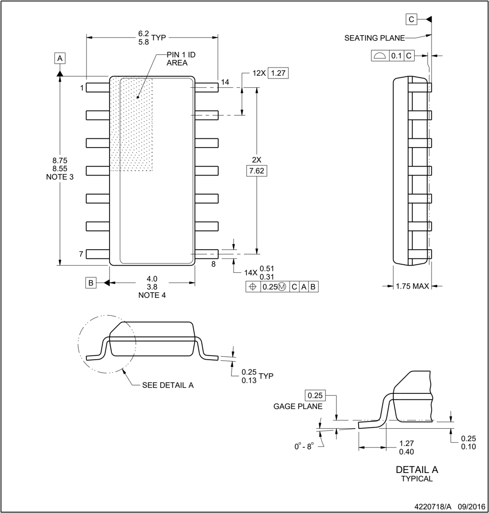

## NOTES:

1. All linear dimensions are in millimeters. Dimensions in parenthesis are for reference only. Dimensioning and tolerancing per ASME Y14.5M.
2. This drawing is subject to change without notice.
3. This dimension does not include mold flash, protrusions, or gate burrs. Mold flash, protrusions, or gate burrs shall not exceed 0.15 mm, per side.
4. This dimension does not include interlead flash. Interlead flash shall not exceed 0.43 mm, per side.
5. Reference JEDEC registration MS-012, variation AB.

SMALL OUTLINE INTEGRATED CIRCUIT

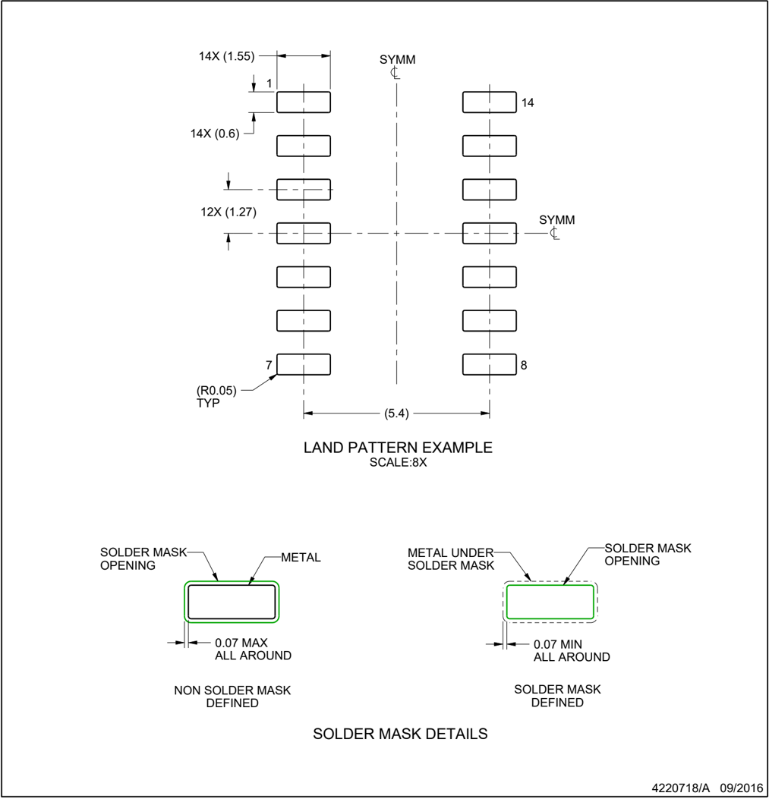

NOTES: (continued)

6. Publication IPC-7351 may have alternate designs.
7. Solder mask tolerances between and around signal pads can vary based on board fabrication site.

## SOIC - 1.75 mm max height

SMALL OUTLINE INTEGRATED CIRCUIT

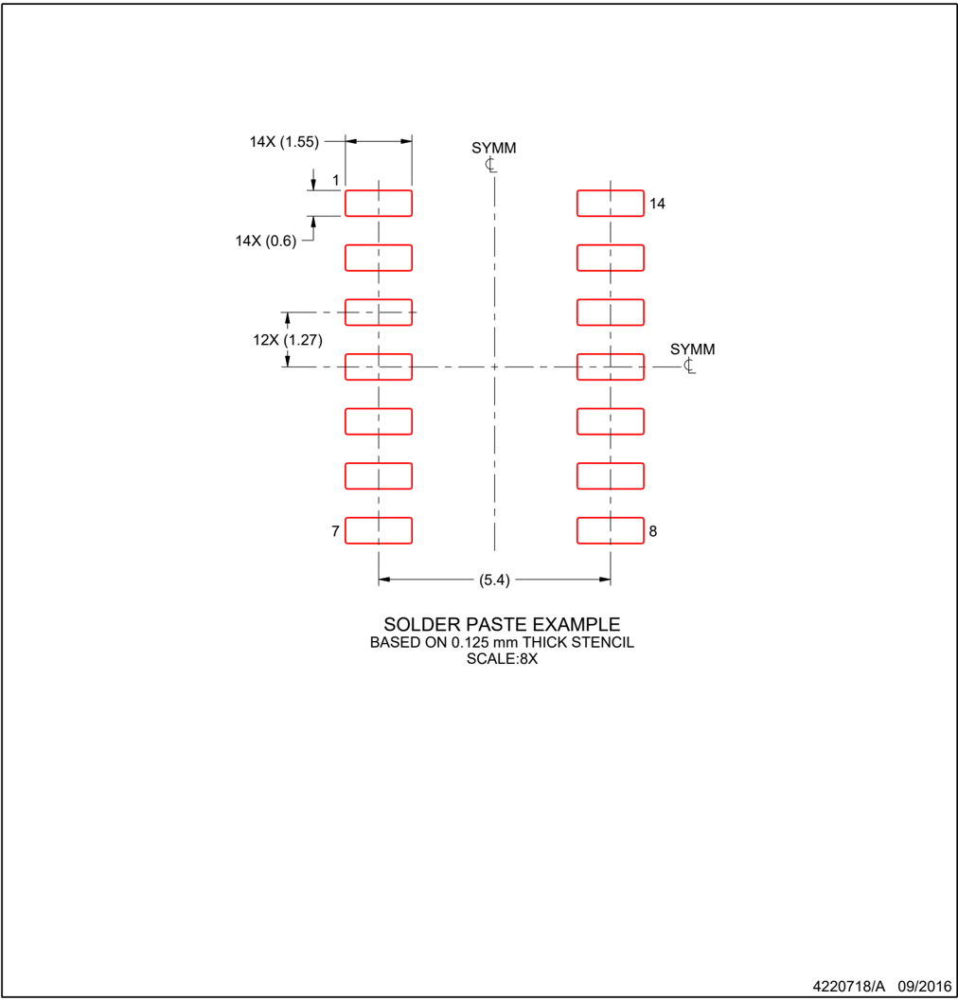

## NOTES: (continued)

8. Laser cutting apertures with trapezoidal walls and rounded corners may offer better paste release. IPC-7525 may have alternate design recommendations.
9. Board assembly site may have different recommendations for stencil design.

## IMPORTANT NOTICE AND DISCLAIMER

TI PROVIDES TECHNICAL AND RELIABILITY DATA (INCLUDING DATASHEETS), DESIGN RESOURCES (INCLUDING REFERENCE DESIGNS), APPLICATION OR OTHER DESIGN ADVICE, WEB TOOLS, SAFETY INFORMATION, AND OTHER RESOURCES 'AS IS' AND WITH ALL FAULTS, AND DISCLAIMS ALL WARRANTIES, EXPRESS AND IMPLIED, INCLUDING WITHOUT LIMITATION ANY IMPLIED WARRANTIES OF MERCHANTABILITY, FITNESS FOR A PARTICULAR PURPOSE OR NON-INFRINGEMENT OF THIRD PARTY INTELLECTUAL PROPERTY RIGHTS.

These resources are intended for skilled developers designing with TI products. You are solely responsible for (1) selecting the appropriate TI products for your application, (2) designing, validating and testing your application, and (3) ensuring your application meets applicable standards, and any other safety, security, regulatory or other requirements.

These resources are subject to change without notice. TI grants you permission to use these resources only for development of an application that uses the TI products described in the resource. Other reproduction and display of these resources is prohibited. No license is granted to any other TI intellectual property right or to any third party intellectual property right. TI disclaims responsibility for, and you fully indemnify TI and its representatives against any claims, damages, costs, losses, and liabilities arising out of your use of these resources.

TI's products are provided subject to TI's Terms of Sale, TI's General Quality Guidelines, or other applicable terms available either on ti.com or provided in conjunction with such TI products. TI's provision of these resources does not expand or otherwise alter TI's applicable warranties or warranty disclaimers for TI products. Unless TI explicitly designates a product as custom or customer-specified, TI products are standard, catalog, general purpose devices.

TI objects to and rejects any additional or different terms you may propose.

IMPORTANT NOTICE

Copyright © 2025, Texas Instruments Incorporated Last updated 10/2025